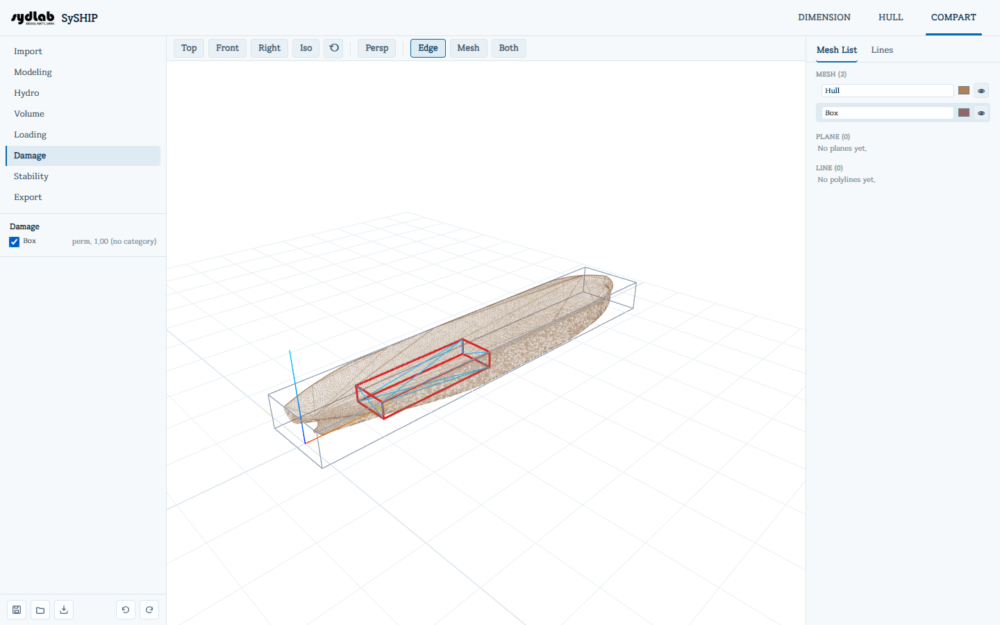

# Damage

손상 복원성 케이스를 위해 어느 구획이 파손·침수된 것으로 가정할지 표시합니다. 여기서 체크한 구획은 다음 [Stability](stability.md) 실행 시 각 구획 카테고리의 **permeability(침투율)**만큼 부력 용적에서 공제됩니다. 아무것도 체크하지 않으면 일반적인 **intact(비손상)** 복원성 계산이 됩니다.

선체와 절단 평면을 제외한 모든 구획이 목록에 나타납니다([Modeling](modeling.md)에서 먼저 만들어야 합니다). 구획의 체크박스를 켜면 침수 처리되며, 옆에 해당 구획의 permeability("perm. 0.85") 또는 [Volume](volume.md)에서 아직 카테고리를 지정하지 않았다면 **"perm. 1.00 (no category)"**가 표시됩니다 — permeability 1.00은 완전히 바닷물에 열려있음을 의미합니다. 즉 구조물이나 적재된 화물이 물을 밀어내는 효과 없이 구획 전체가 침수됩니다.

침수된 구획의 형상은 자신의 중심(centroid)을 기준으로 permeability1/3 배만큼 선형 크기가 줄어들도록 스케일링되며(부피 기준으로는 정확히 permeability 비율에 해당), 안정성 계산의 매 heel/trim/draft 시도마다 침수 부력 용적에서 공제됩니다.

침수된 구획은 3D View에서 빨간색 외곽선으로 표시됩니다. Stability 실행 후에는 평형 흘수까지, 평형 heel/trim에 맞춰 기울어진 반투명한 바닷물 색상 채움도 함께 표시됩니다.
