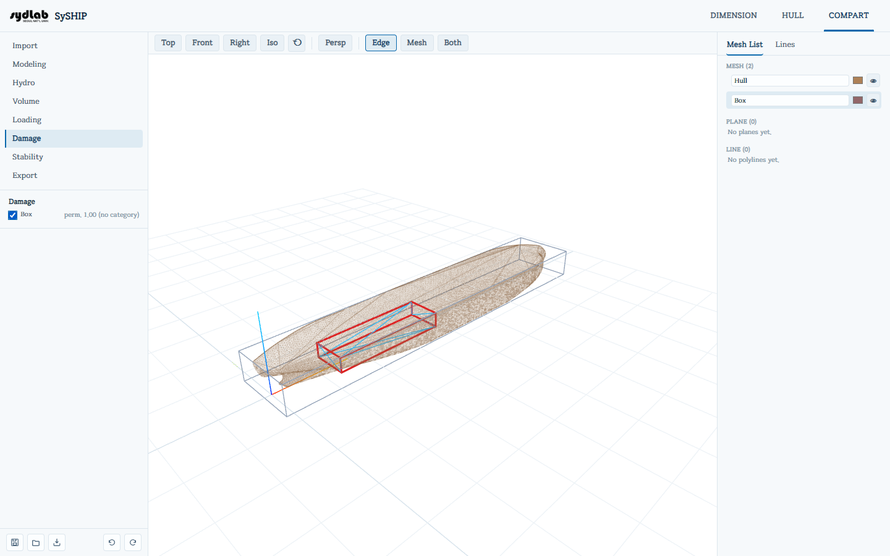

# Damage

손상 복원성 케이스를 위해 어느 구획이 파손·침수된 것으로 가정할지 표시합니다. 여기서 체크한 구획은 각 구획 자체의 **Permeability**([Volume](volume.md)에서 구획별로 설정)만큼 부력 용적에서 공제되며, 다음 [Stability](stability.md) 실행에 반영됩니다. 아무것도 체크하지 않으면 일반적인 **intact(비손상)** 복원성 계산이 되고, 하나 이상 체크하면 해당 실행은 intact 기준 대신 **MARPOL Annex I** / **ICLL Type A** 손상 복원성 기준으로 평가됩니다.

**Mesh List**에서 하나 이상의 구획을 **Flooded compartments** 드롭 박스로 드래그하면 침수 처리됩니다(선체와 절단면은 여기 드롭할 수 없으며, 시도하면 이유를 설명하는 안내가 표시됩니다). 각 행에는 ([Volume](volume.md)에서 가져온) permeability가 읽기 전용으로 표시되며, × 버튼으로 침수 목록에서 제거할 수 있습니다.

침수된 구획의 형상은 자신의 중심(centroid)을 기준으로 permeability1/3 배만큼 선형 크기가 줄어들도록 스케일링되며(부피 기준으로는 정확히 permeability 비율에 해당), 안정성 계산의 매 heel/trim/draft 시도마다 침수 부력 용적에서 공제됩니다.

침수된 구획은 3D View에서 빨간색 외곽선으로 표시됩니다. Stability 실행 후에는 평형 흘수까지, 평형 heel/trim에 맞춰 기울어진 반투명한 바닷물 색상 채움도 함께 표시됩니다.

intact와 damage 기준 모두에서 침수각과 최종 흘수선 검사에 쓰이는 **Openings**(down-flooding point)는 여기가 아니라 [Stability](stability.md) 탭에서 설정합니다.