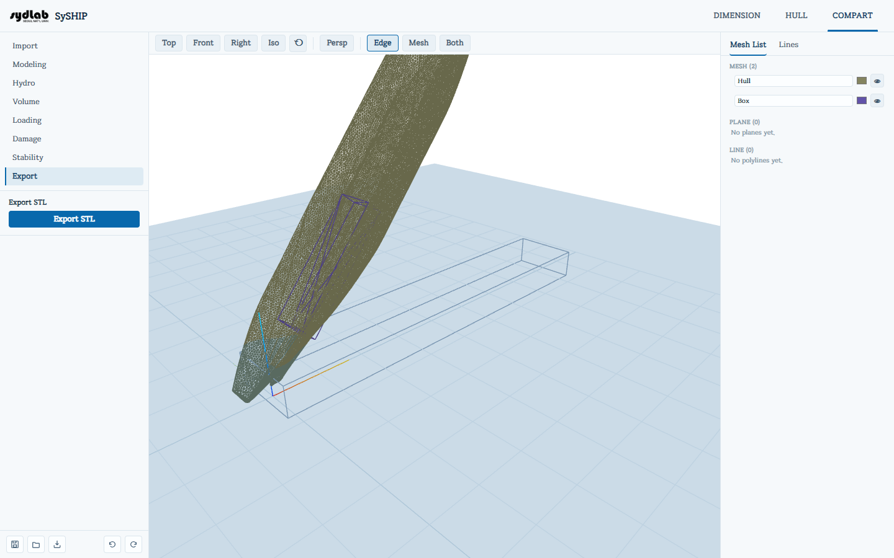

# Export

모델링한 모든 구획을 **하나로 병합된 STL**로 내보냅니다 — SySHIP 밖에서(3D 프린팅, CAD, CFD 등) 전체 구획 모델을 열어볼 때 유용합니다.

**Export STL**을 클릭합니다. 인접한 구획끼리 공유하는 벽면은 두 개의 겹치는 면으로 남지 않고 하나의 판으로 용접/병합되며, 성공 메시지에 몇 개의 공유 벽면이 병합되었는지 표시됩니다. 결과는 `compart_merged.stl`로 다운로드됩니다.

이 탭에는 이 기능 하나만 있으며, 항상 모든 구획을 함께 병합합니다 — 아직 개별 구획 하나만 따로 내보내는 버튼은 없습니다.
