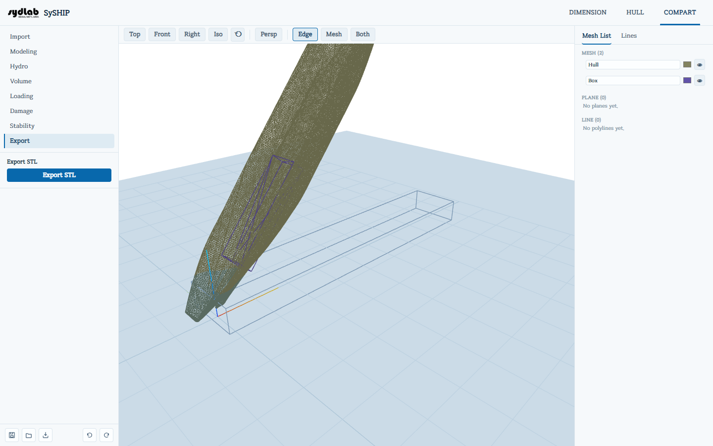

# Export

Two independent downloads.

## Export Hull STL

Downloads the hull exactly as it was imported from HULL — the original watertight shell,
without any compartments or Modeling edits — as `<hull name>.stl`. Useful when you want the
outer hull surface on its own, separate from whatever's been built inside it.

## Export STL

Exports every modeled compartment as a **single merged STL** (`compart_merged.stl`) —
useful for opening the whole compartment model outside SySHIP (3D printing, CAD, CFD). Any
walls shared between adjacent compartments are welded/merged into a single plate rather than
kept as two overlapping surfaces; a success message reports how many shared walls were
merged.

This always merges every compartment together — there's currently no button to export a
single compartment's mesh on its own.