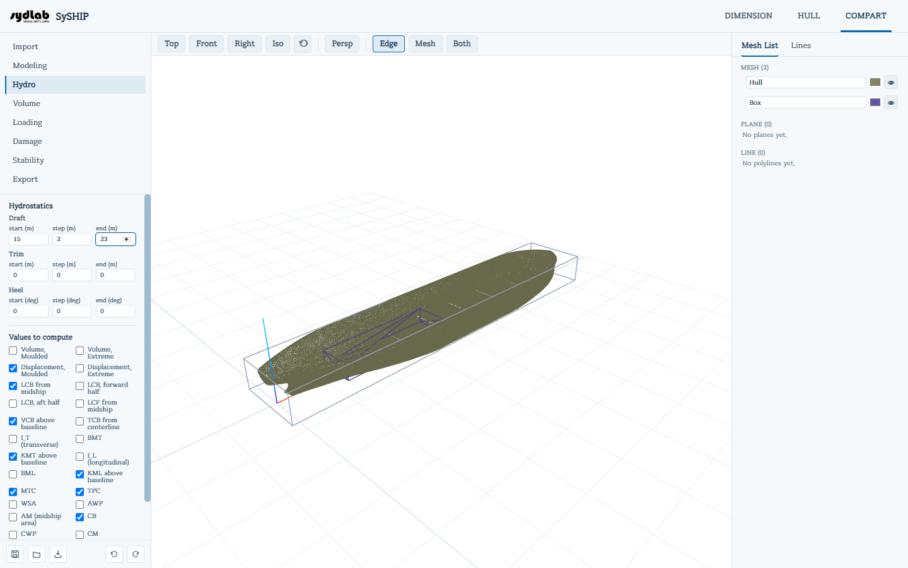
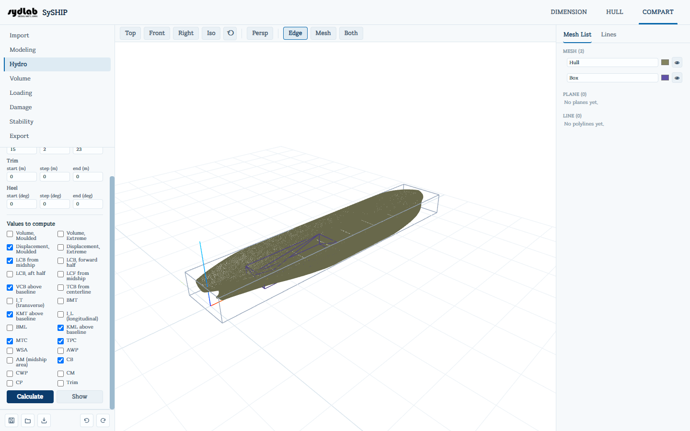
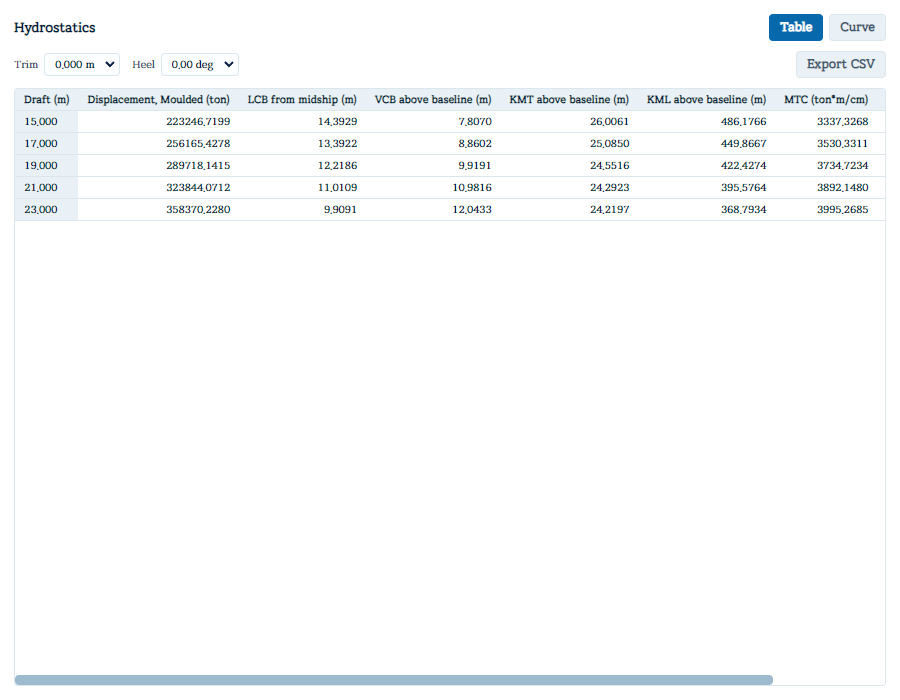

# Hydro

배수량, 부력/부심 중심, 메타센터 높이, 형상 계수 등 흘수/트림/힐 스윕에 걸친 주요 정수계산(hydrostatics) 값들의 표를 계산합니다. 전형적인 선박의 "정수계산 표와 곡선"으로, HULL 탭의 Properties 패널(단면선으로부터 하나의 흘수에 대한 값만 계산)과 달리 실제 COMPART 선체 mesh 위에서 직접 계산됩니다.

선체 mesh와 그 AP/FP가 필요합니다(**New from HULL**을 실행할 때 HULL에서 자동으로 가져옵니다). HULL에서 AP/FP를 설정하기 전에 임포트했다면, 그곳에서 설정한 뒤 다시 임포트하라는 안내가 표시됩니다.

## 스윕 설정하기

- **Shell thickness (mm)** — 모델링된(moulded) 선체 표면에 더할 선택적인 외판 두께입니다. 아래의 **Extreme** 값에만 영향을 줍니다: Volume/Displacement Extreme = moulded 값 + 침수 표면적 × 이 두께로, mesh를 다시 만들지 않고도 외판 바깥쪽 외피를 근사합니다. 모델링된 표면 자체를 외피로 취급하려면 0으로 둡니다.
- **Draft**, **Trim**, **Heel** — 각각 **start / step / end** 범위입니다(Draft와 Trim은 m, Heel은 deg). 흘수만 신경 쓴다면 Trim과 Heel은 기본값 0/0/0(직립, 등흘수)으로 둡니다.
- **Hydrostatic Values** — 사용 가능한 모든 항목의 체크박스 목록으로, 기본적으로 전부 체크되어 있습니다: Volume(Moulded와 Extreme), Displacement(Moulded와 Extreme), LCB(전체, 전반부, 후반부), LCF, VCB, TCB, 횡/종 관성모멘트(IT/IL), BMT/KMT, BML/KML, MTC, TPC, WSA, AWP, AM, CB/CWP/CM/CP, Trim.

**Calculate**를 클릭합니다.

## 결과 보기

**Show**를 클릭하면 별도의 결과 창이 열립니다:

- 상단의 **Table / Curve** 전환.
- **Trim** / **Heel** 드롭다운으로 스윕의 어느 슬라이스를 표시할지 고릅니다.
- **Table view**: 흘수 지점마다 한 행, 선택한 항목마다 단위가 표시된 한 열입니다. **Export CSV** 버튼은 (표시된 슬라이스가 아니라) *전체* 그리드를 내려받습니다.
- **Curve view**: 선택한 각 항목을 흘수에 대한 곡선으로 그립니다(흘수는 세로축, 아래에서 위로 증가). 차트 위쪽의 축 범위 필드로 자동 스케일 대신 X축과 Draft 범위, 격자 간격을 직접 고정할 수 있습니다. 오른쪽 범례에서 각 시리즈를 켜고 끄거나, 색을 바꾸거나, 숫자 **scale**과 **offset**을 적용해 크기 차이가 큰 곡선들(예: TPC와 LCB)을 하나의 읽기 쉬운 차트에 함께 담을 수 있습니다. **Export Image**는 차트를 PNG로 래스터화합니다.