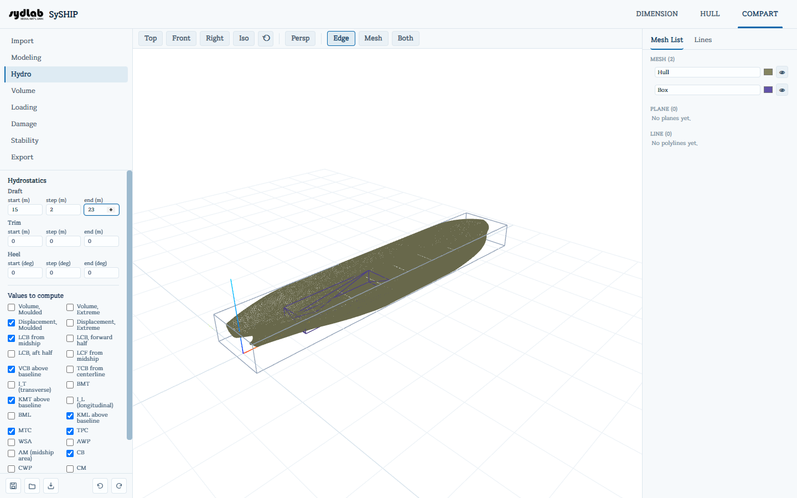
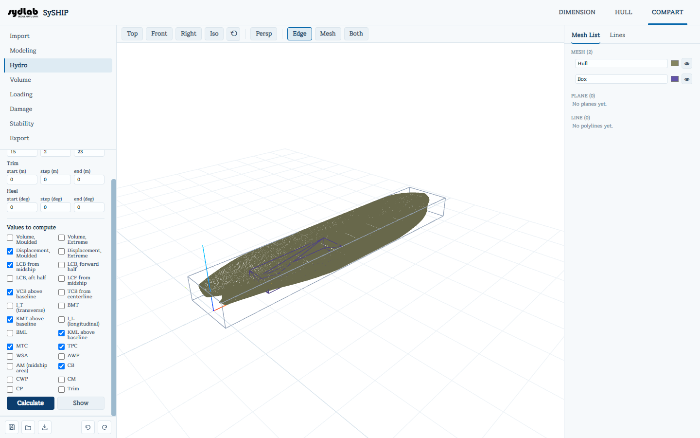
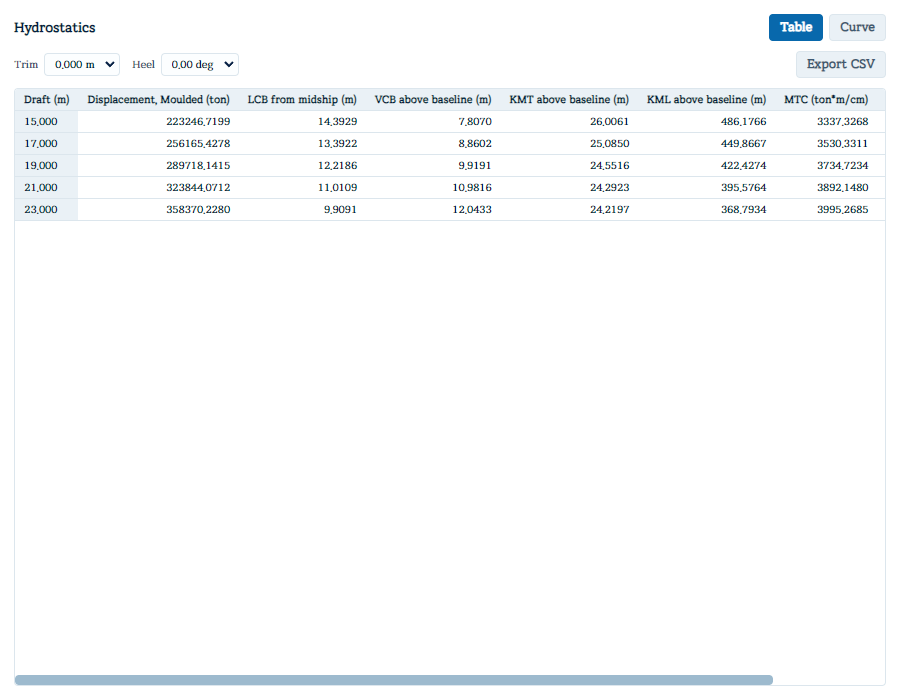

# Hydro

Computes a grid of hydrostatic particulars — displacement, centers of buoyancy/flotation,
metacentric heights, form coefficients, and more — over a sweep of draft/trim/heel. This is
the classic "hydrostatic tables and curves" of a hull, computed directly on the actual
COMPART hull mesh (as opposed to the HULL tab's Properties panel, which computes a single
draft's values from the section lines).

Requires a hull mesh and its AP/FP (captured automatically from HULL when you ran **New
from HULL**). If you imported before AP/FP were set in HULL, a hint tells you to set them
there and re-import.

## Setting up the sweep

- **Draft**, **Trim**, **Heel** — each a **start / step / end** range (Draft and Trim in m,
  Heel in degrees). Trim and Heel default to 0/0/0 (upright, even keel) if you only care
  about draft.
- **Values to compute** — a checkbox grid of every available field: Volume (moulded and
  extreme), Displacement (moulded and extreme), LCB (overall, forward-half, aft-half),
  LCF, VCB, TCB, transverse and longitudinal moments of inertia (IT/IL),
  BMT/KMT, BML/KML, MTC, TPC, WSA, AWP,
  AM, CB/CWP/CM/CP, and Trim. A
  sensible subset is pre-checked by default.

Click **Calculate**.

## Viewing results

Click **Show** to open a separate results window:

- **Table / Curve** toggle at the top.
- **Trim** / **Heel** dropdowns pick which slice of the sweep to display.
- **Table view**: one row per draft point, one column per selected field with its unit; an
  **Export CSV** button downloads the *entire* grid (every trim/heel slice, not just the
  one shown).
- **Curve view**: every selected field plotted as its own curve against draft (draft on the
  vertical axis, low to high bottom-to-top). A legend on the right lets you enable/disable
  each series, recolor it, and apply a numeric **scale** and **offset** so curves of very
  different magnitude (say TPC and LCB) can share one readable chart. **Export Image**
  rasterizes the chart to a PNG.
