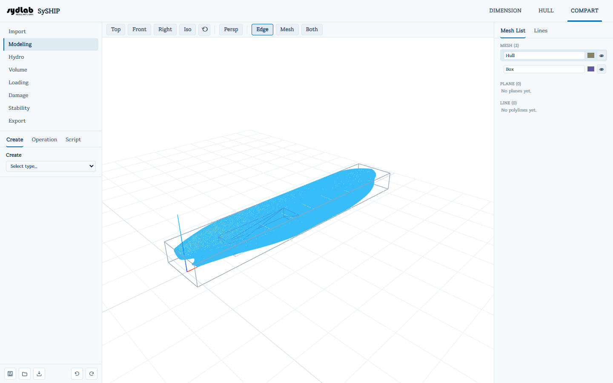

# Import

Starts a new COMPART project using a hull already imported in the **HULL** tab as the
outer shell. This is the only sub-tab available before a project exists.

Click **New from HULL** (disabled with a hint if no hull has been imported yet). If HULL
has more than one named geometry, a picker of secondary buttons appears so you can choose
which one to use; with just one, it proceeds immediately.

This:

- Imports the chosen hull as a mesh named **"Hull"** (and keeps a separate, untouched copy of
  it around for [Export](export.md)'s "Export Hull STL" and for [Stability](stability.md)'s
  damage-extent reference table).
- Snapshots the hull's current station/waterline/buttock lines and its AP/FP positions, and
  its principal dimensions, into the COMPART project — the lines are visible read-only under
  the **Lines** tab of the Mesh List, and both are what [Modeling](modeling.md) scripts
  reference through `$LOA`/`$LBP`/.../`$ST5`/`$WL7`/etc.

If a COMPART project already exists, **New from HULL** first asks you to confirm — it
discards everything in the current project.

