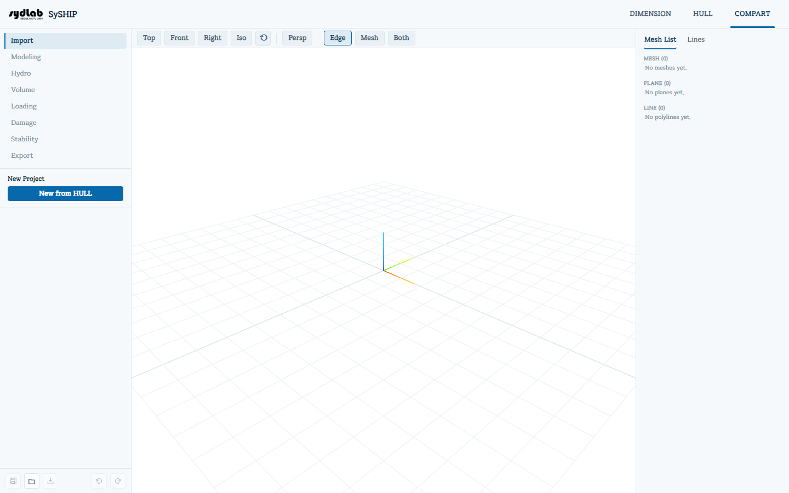

# COMPART

COMPART는 임포트한 선체 내부에 구획과 탱크를 만들고, 그 결과에 대해 정수력학, 탱크 용적/loading factor 계산, 적하 상태(loading condition), 손상/침수 케이스, 복원성(GZ 곡선, IMO/MARPOL/ICLL 기준 평가 포함) 계산을 수행합니다.

## 서브탭

| 서브탭 | 용도 |
|---|---|
| [Import](import.md) | HULL 탭에서 임포트한 선체로 새 COMPART 프로젝트를 시작합니다. |
| [Modeling](modeling.md) | 구획/탱크 솔리드를 만듭니다(박스, 실린더, 평면, 곡면 로프트, 불리언 연산, 또는 일괄 스크립트) — Create / Operation / Script 내부 탭으로 구성됩니다. |
| [Hydro](hydro.md) | 선택적인 외판 두께 보정과 함께 draft/trim/heel 스윕에 걸친 정수력학 제원을 계산합니다. |
| [Volume](volume.md) | 구획에 화물 카테고리를 지정하고 Reduction/Filling/Permeability loading factor를 설정합니다. |
| [Loading](loading.md) | 경하중량/무게중심을 설정하고 구획을 채워 적하 상태를 만듭니다. |
| [Damage](damage.md) | 손상 복원성 케이스를 위해 침수될 구획을 지정합니다. |
| [Stability](stability.md) | 평형 heel/trim과 복원정(GZ) 곡선을 계산하고, 복원성 기준과 비교 평가합니다. |
| [Export](export.md) | 모델링한 구획을 하나로 병합된 STL로 내보냅니다. |

Import를 제외한 모든 서브탭은 프로젝트가 존재해야(즉, "New from HULL"을 한 번 실행해야) 활성화됩니다.

## 공통 UI

다음 요소들은 모든 COMPART 서브탭에서 공통으로 표시됩니다:

- **View toolbar**(3D 뷰포트 위) — HULL의 3D View와 동일한 컨트롤입니다: **Edge** / **Mesh** 표시 전환(서로 독립적이라 둘 다 켤 수 있습니다), **Zoom Out/In**, **Section View** / **Elevation View** / **Plan View** 카메라 스냅 버튼(HULL과 동일한 조선 관례 — 각각 선미/우현에서 바라보는 시점), **Fit View**, 그리고 **Persp/Ortho** 투영 전환.
- **Mesh List**(오른쪽 패널, **Lines** 탭과 함께 표시): 프로젝트 안의 모든 mesh를 드래그로 순서를 바꿀 수 있는 **레이어**로 정리해서 보여줍니다(읽기 전용인 "Unassigned" 레이어와, 있다면 원본으로 임포트된 선체도 별도로 표시됩니다). 각 행에는 이름 편집, 색상 스와치, 표시/숨김 버튼이 있으며, 행(또는 다중 선택)을 우클릭하면 **Rename / Copy / Delete** 컨텍스트 메뉴가 나타납니다. 행을 클릭하면 선택되는데, 이것이 Modeling, Volume, Loading, Damage가 *어느* 구획에 대해 동작할지를 지정하는 방법이며, 행을 그대로 드래그해서 해당 탭들이 보여주는 드롭 박스(Modeling Operation의 targets/cutters, Damage의 flooded 목록)에 넣을 수도 있습니다. 목록 아래의 **Inspector** 패널은 현재 선택 영역의 watertight 여부, 부피, centroid, 카테고리, loading factor를 읽기 전용으로 보여줍니다. **Lines** 탭은 (임포트 시점의) 선체 station/waterline/buttock line을 읽기 전용으로 보여주며, 하나를 클릭하면 절단 평면처럼 미리보기가 표시되고, 그 값을 COMPART의 다른 숫자 필드 위로 드래그해 그 line의 위치 값을 채울 수도 있습니다.
- **하단 고정 바** — Save / Load / Save As / Undo / Redo로, HULL의 프로젝트 액션 바와 동일한 방식입니다. COMPART 프로젝트는 HULL 프로젝트 파일과 별개로 `.zip` 파일로 저장됩니다.

COMPART 내부적으로 모든 위치는 밀리미터로 저장되고 화면에는 미터로 표시됩니다. 용적은 m³, 면적은 m², 무게는 톤, 밀도는 t/m³ 단위입니다.