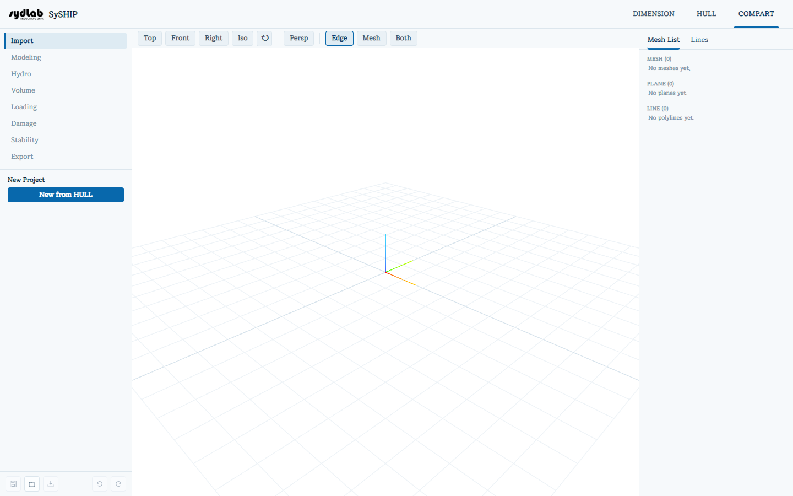

# COMPART

COMPART builds internal compartments and tanks inside an imported hull, then runs
hydrostatics, tank capacity, loading conditions, damage/flooding cases, and stability
(righting-arm/GZ) calculations on the result.

## Sub-tabs

| Sub-tab | Purpose |
|---|---|
| [Import](import.md) | Start a new COMPART project from a hull imported in the HULL tab. |
| [Modeling](modeling.md) | Build compartment/tank solids (box, cylinder, plane, lofted surface, boolean operations, or a batch script). |
| [Hydro](hydro.md) | Hydrostatic particulars over a sweep of draft/trim/heel. |
| [Volume](volume.md) | Assign a compartment a cargo category, and compute its sounding-height capacity table. |
| [Loading](loading.md) | Set lightship weight/CG and fill compartments to build a loading condition. |
| [Damage](damage.md) | Mark compartments as flooded for a damage-stability case. |
| [Stability](stability.md) | Solve the equilibrium heel/trim and righting-arm (GZ) curve. |
| [Export](export.md) | Export the modeled compartments as a single merged STL. |

All sub-tabs except Import are disabled until a project exists (i.e., until you've run
"New from HULL" once).

## Shared UI

These elements are present on every COMPART sub-tab:

- **View toolbar**, above the 3D viewport: camera presets **Top / Front / Right / Iso**, a
  **Reset View** (⟲) button, a **Persp/Ortho** projection toggle, and **Edge / Mesh / Both**
  render-mode buttons.
- **Mesh List** (right panel, next to a **Lines** tab): every mesh, plane, and polyline in
  the project, each with an editable name, a color swatch, and a show/hide button. Clicking
  a row selects it — this is how you tell Modeling, Volume, Loading, and Damage *which*
  compartment to act on. The **Lines** tab is a read-only copy of the hull's station/
  waterline/buttock lines (captured at import time) — click one to preview it as a cutting
  plane, handy as a guide while modeling.
- **Sticky footer** — Save / Load / Save As / Undo / Redo, same conventions as HULL's
  project actions bar; COMPART projects save as `.zip` files independent of the HULL
  project file.

Internally, all COMPART positions are stored in millimeters and shown to you in meters;
volumes in m³, areas in m², weights in tonnes, densities in t/m³.
