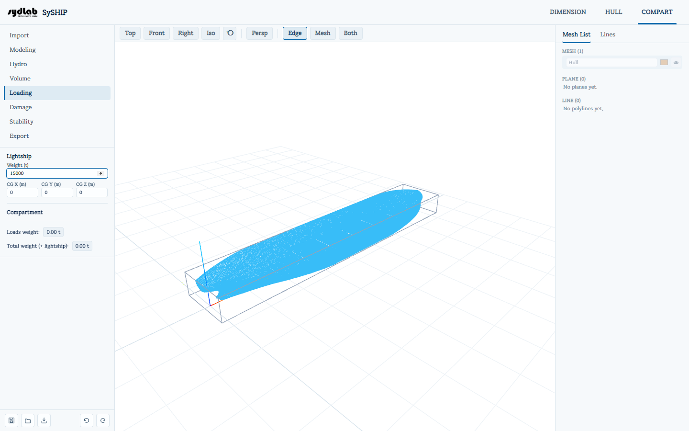

# Loading

선박의 경하중량/무게중심에 각 카테고리 구획이 얼마나 채워졌는지를 더해 적하 상태를 구성합니다. 그 결과로 나온 총중량과 무게중심을 [Stability](stability.md)가 그대로 사용해 평형을 계산합니다.

## Lightship

- **Weight (t)**와 **CG X/Y/Z (m)**.
- DIMENSION design ship이 존재하고 무게가 아직 0이라면 **"Use DIMENSION estimate (N t)"** 버튼이 나타납니다 — 클릭 한 번으로 [DIMENSION → Principal Dimensions](../dimension/principal-dimensions.md)의 Ws+Wo+Wm 값을 채웁니다.

## 구획 적재

**Mesh List**에서 하나 이상의 구획을 선택합니다 — [Volume](volume.md)에서 이미 카테고리를 지정한 구획만 여기서 선택할 수 있으며, 나머지는 이 탭이 활성화되어 있는 동안 비활성(회색) 처리됩니다. 선택한 뒤에는:

- **Fill (%)** — 선택한 모든 구획에 공통으로 적용되는 채움 비율입니다(선택된 구획들의 채움 비율이 다르면 "mixed"로 표시됩니다). 구획은 항상 바닥에서부터 채워집니다.
- **Weight (t)**(여러 구획을 선택했다면 **Total weight (t)**) — 해당 채움 비율에 해당하는 무게입니다. 이 값을 직접 입력하면 채움 비율로 역산됩니다. 아래의 **Weight range: 0 – N t** 안내는 이 선택 범위가 담을 수 있는 최대치를 보여주며, 각 구획의 부피, **Reduction**, **Filling**, 카테고리 밀도로 계산됩니다([Volume](volume.md) 참고 — 100% 채움 시 loadable volume은 `volume × reduction × filling`이고, 그 무게는 이 부피에 카테고리 밀도를 곱한 값입니다).

두 필드 모두 실시간으로 갱신되며 즉시 반영됩니다 — 별도의 Apply 버튼은 없습니다.

## Summary

- **Deadweight** — 적재된 모든 구획의 무게 합계입니다.
- **Total weight** — deadweight + 경하중량입니다. 이 총중량과 그 뒤에 있는 결합 무게중심이 [Stability](stability.md)가 평형을 계산할 때 그대로 사용하는 선박의 무게/무게중심입니다.

적재된 구획은 3D View에서 현재 채움 비율에 맞는 수면까지 채워진 반투명한 색상 솔리드로 표시됩니다.