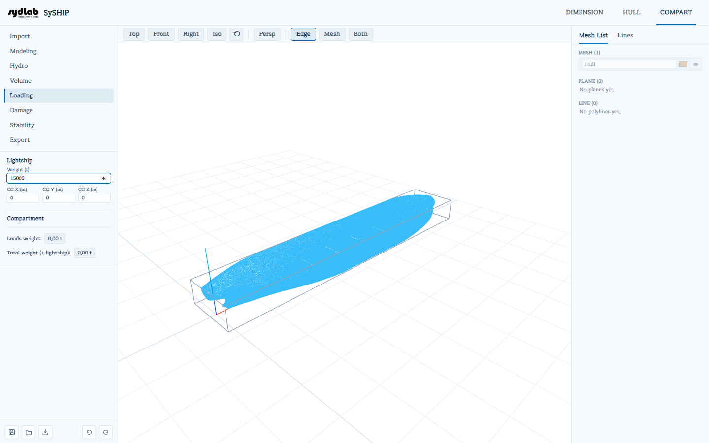

# Loading

Builds a loading condition: the ship's lightship weight/CG plus however full each
categorized compartment is, combining into a total weight and CG that
[Stability](stability.md) solves against.

## Lightship

- **Weight (t)** and **CG X/Y/Z (m)**.
- If a DIMENSION design ship exists and the weight is still 0, a **"Use DIMENSION estimate
  (N t)"** button appears — one click fills it with Ws+Wo+Wm
  from [DIMENSION → Principal Dimensions](../dimension/principal-dimensions.md).

## Loading a compartment

Only compartments that already have a category assigned (in [Volume](volume.md)) can be
loaded — others are grayed out in the Mesh List while this tab is active. Pick one, then:

- Its category and specific gravity are shown read-only.
- A **fill percentage** slider (0–100%, with a synced number field) sets how full it is.
- The resulting **volume (m³) / weight (t)** at that fill level is shown live.
- Click **Apply** to commit that compartment's load (always filled from the tank bottom
  upward).

## Loads summary

Once at least one compartment is loaded, a read-only **Loads** list shows every loaded
compartment's name, category, fill percentage, and weight. Below it:

- **Loads weight** — sum of every compartment's weight.
- **Total weight (+ lightship)** — loads weight + lightship weight. This total, and the
  combined center of gravity behind it, is exactly what [Stability](stability.md) uses as
  the ship's weight/CG when solving for equilibrium.

Loaded compartments render as translucent colored solids in the 3D View (blue for liquid,
brown for solid, gray for void categories), filled to the correct surface for the current
fill level.
