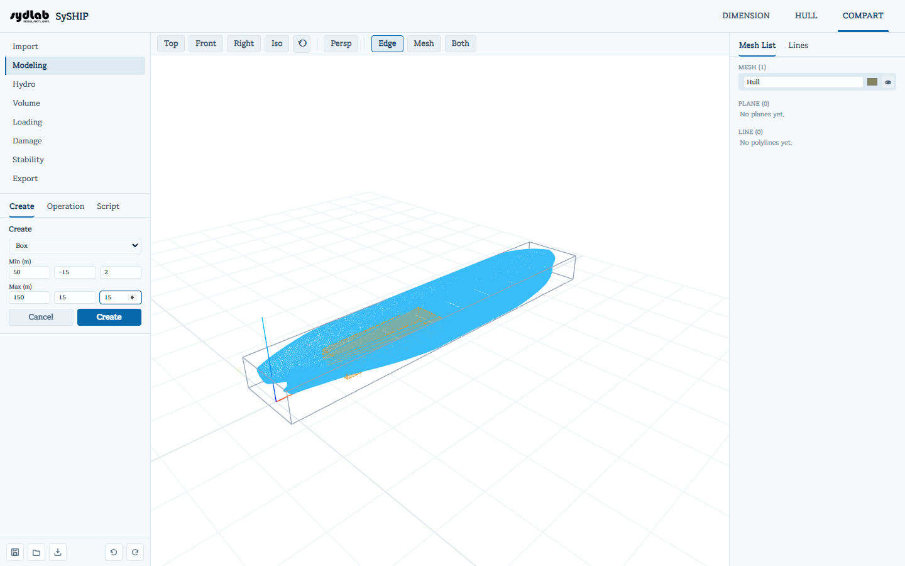
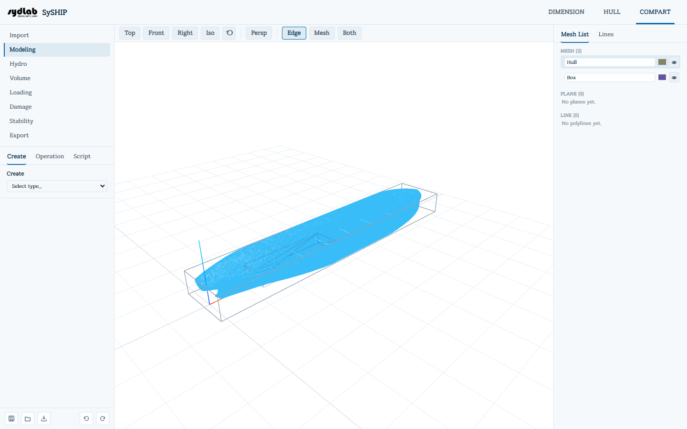
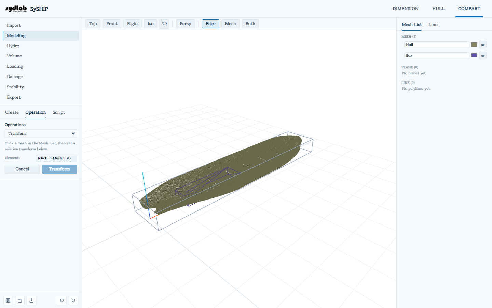
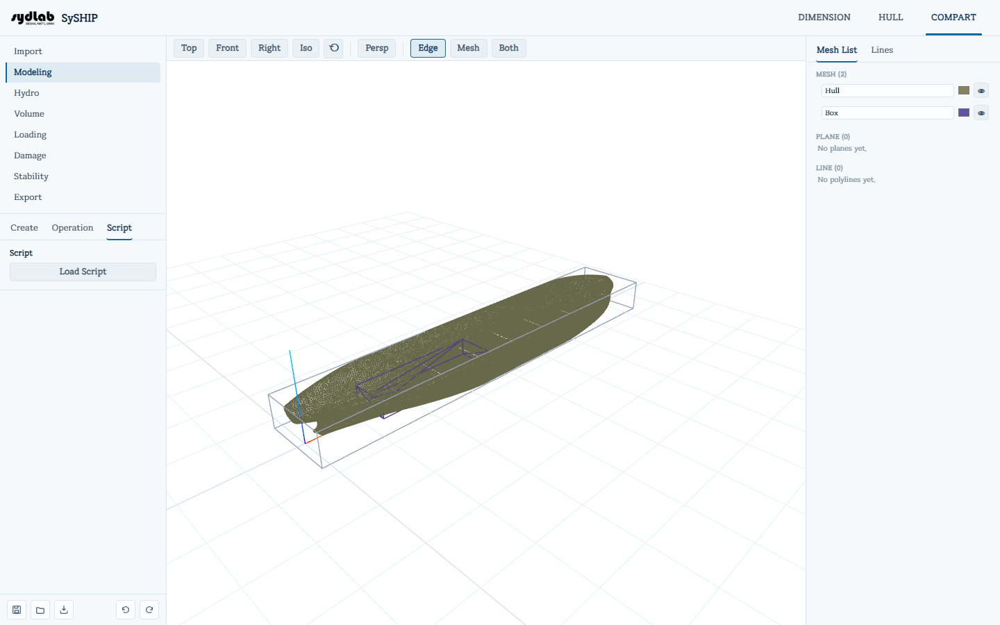

# Modeling

Modeling is where compartments and tanks actually get built — as solid shapes you create,
combine, cut, and transform. It has three inner tabs: **Create**, **Operation**, and
**Script**.

## Create


Pick a shape type from the dropdown; the form below switches to match it. Every shape
shows a **live preview** in the 3D View as you type, before you commit it:

| Type | Fields | Notes |
|---|---|---|
| **Box** | Min (x,y,z), Max (x,y,z), all in m | Axis-aligned box. |
| **Cylinder** | Radius (m), Point 1 (x,y,z), Point 2 (x,y,z) | A cylinder running between the two points. |
| **Plane** | Axis (X/Y/Z), Position (m) | A cutting plane perpendicular to the chosen axis, sized to the current compartment grid. |
| **Polyline** | Axis, Position (m), a list of 2D (a, b) points | A named, colored 2D outline at a fixed position on one axis — the building block for **Skinsurf**. Points can be reordered (▲/▼), inserted, or removed. Click **Add Polyline** to save it (it appears under the Mesh List's **Line** section, not as a solid). |
| **Skinsurf** | (no direct fields) | Lofts a surface through **2 or more** existing polylines. Click them in the Mesh List's Line section, in loft order; they must share the same axis and point count. |
| **Load** | STL file | Imports an arbitrary external STL as a new compartment shape. |



Click **Create** to commit the shape (added to the Mesh List), or **Cancel** to discard it.



## Operation



Pick an operation from the dropdown, then click elements **in the Mesh List** (not the 3D
view) to fill its "slots," as prompted by the on-screen hint:

| Operation | Slots | Effect |
|---|---|---|
| **Union** | Mesh 1, Mesh 2 | Combines two meshes into one; the originals are removed. |
| **Intersect** | Mesh 1, Mesh 2 | Keeps only the overlapping volume. |
| **Subtract** | Target, Tool | Removes the Tool's volume from the Target. |
| **Split (Mesh)** | Target, Cutting tool | Splits the Target wherever the cutting-tool mesh passes through it, producing multiple new meshes. |
| **Split (Plane)** | Target, Cutting plane | Same, using a Plane mesh as the cutter. |
| **Copy** | Element | Duplicates the selected mesh. |
| **Delete** | Element | Removes the selected mesh, plane, or polyline. |
| **Transform** | Element | Applies Translate/Rotate/Scale, and optionally a mirror, to the selected mesh (see below). |

**Transform** fields, once a mesh is picked:

- **Translate (m)** — dx/dy/dz.
- **Rotate (degrees, about the origin)** — around each axis.
- **Scale (factor, 1 = no change)** — per axis.
- **Also mirror** — reflects the mesh across a chosen axis at a given position (m).

Click the operation's button (its label matches the chosen operation) to run it, or
**Cancel** to back out and clear the picked slots.

## Script



For batch or parametric compartment modeling, **Load Script** runs a small text-based
scripting language (`.txt` / `.script` / `.dsl` files) that can create shapes, boolean them
together, transform them, and export results — all in one file. Loading a script shows a
plain-English, step-by-step **preview** of what it will do before anything is actually
created; review it, then **Confirm** to run it (or **Cancel** to discard).

Scripts can reference the current hull's principal dimensions (taken from the HULL tab's
hydrostatics, in millimeters — the same internal unit every coordinate in a script is
written in) as system variables: `$LOA`, `$LBP`, `$LWL`, `$BEAM`, `$BWL`, `$DEPTH`,
`$DRAFT`. Arithmetic (`+ - * /`, parentheses) works on any expression.

**Available statements** (one per line; `//` starts a comment):

| Statement | Syntax | Purpose |
|---|---|---|
| Variable | `var name = expr` | Defines a named number you can reuse in later expressions. |
| Split | `xsplit name = expr` (or `ysplit`/`zsplit`) | Names one cut position along an axis. Add one line per cut to build up a set of named stations. |
| Grid | `grid min (x,y,z) max (x,y,z)` | Sets the overall bounding grid the splits/cells apply within. |
| Box | `box name = min (x,y,z) max (x,y,z)` | Same as the Create panel's Box. |
| Cylinder | `cylinder name = radius (r) p1 (x,y,z) p2 (x,y,z)` | Same as the Create panel's Cylinder. |
| Plane | `plane name = origin (x,y,z) normal (x,y,z) size (s)` | A cutting/reference plane. |
| Skinsurf | `skinsurf name = direction (x) profile(depth(d), points[(a,b), ...]) profile(...)` (2+ profiles) | Lofts a surface through named profiles. |
| Union | `union name = a + b [+ c ...]` | Combines 2 or more named shapes. |
| Intersect | `intersect name = a & b` | Keeps only the overlap of two shapes. |
| Subtract | `subtract name = target - tool` | Removes `tool`'s volume from `target`. |
| Split by mesh | `split (inside, outside) = target by tool` | Splits `target` by another mesh, naming the two resulting pieces. |
| Split by plane | `split (inside, outside) = target by plane origin (x,y,z) normal (x,y,z) size (s)` | Same, using an inline plane instead of a named mesh. |
| Transform | `translate name (dx,dy,dz)` / `rotate name (rx,ry,rz)` / `scale name (sx,sy,sz)` | Transforms a named shape in place. |
| Mirror | `mirror name axis = y at = expr` | Mirrors a named shape across an axis at a position. |
| Copy | `copy name = source` | Duplicates a named shape. |
| Delete | `delete name` | Removes a named shape. |
| Cell | `cell "name" = between(x: lo..hi, y: lo..hi, z: lo..hi)` | Creates a box spanning one cell of the split grid — each axis is optional (omit for the grid's full extent) and its `lo`/`hi` are split names (or the literal `min`/`max`). |
| Cells | `cells "name" = chain axis = x [s0, s1, s2, ...] between(y: ..., z: ...)` | Creates a chain of adjacent cells between each pair of consecutive splits along one axis. |
| Clip | `clip [name, ...] to hullName` | Trims the listed shapes to the inside of a hull mesh. |
| Export | `export "filename.stl" = [name, ...]` | Merges the listed shapes into a single STL, downloaded once the script runs. |

A short, verified example — one box compartment sized to a fraction of the hull's own
length, then exported:

```text
// A single midship tank, 1/3 of LBP long, centered on midship.
var tankLength = $LBP / 3
var midX = $LBP / 2

box tank = min (midX - tankLength / 2, -$BEAM / 2, 0) max (midX + tankLength / 2, $BEAM / 2, $DEPTH)

export "tank.stl" = [tank]
```

If a script fails to parse or run, the error message names the line number and the
problem.
