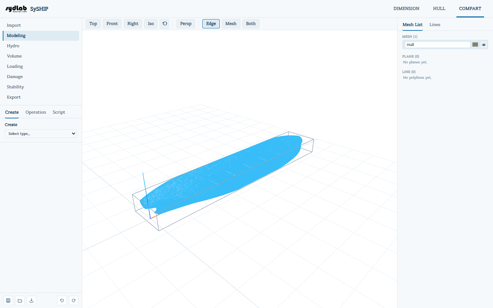
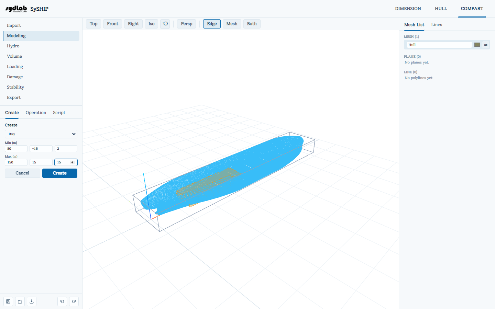
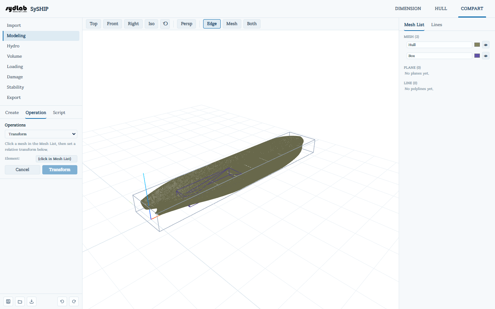
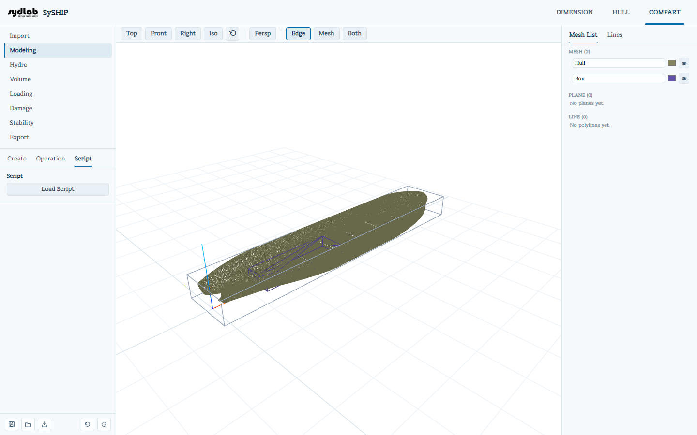

# Modeling

Modeling is where compartments and tanks actually get built — as solid shapes you create,
combine, cut, and transform. It has three inner tabs: **Create**, **Operation**, and
**Script**.

## Create



Pick a shape type from the dropdown; the form below switches to match it. Box, Cylinder, and
Plane show a **live preview** in the 3D View as you type, before you commit them:

| Type | Fields | Notes |
|---|---|---|
| **Box** | Min (x,y,z), Max (x,y,z), all in m | Axis-aligned box. |
| **Cylinder** | Radius (m), Point 1 (x,y,z), Point 2 (x,y,z) | A cylinder running between the two points. |
| **Plane** | Axis (X/Y/Z), Position (m) | A cutting plane perpendicular to the chosen axis, sized to the current hull's bounds. |
| **Skinsurf** | Num points, Axis, one or more **polylines** | Lofts a surface through 2 or more polylines, entered directly in this panel (see below). |
| **Load** | STL file | Imports an arbitrary external STL as a new compartment shape. |

**Skinsurf** no longer needs separate polyline meshes: set **Num points** (how many 2D points
each cross-section has) and the **Axis** the profiles are stacked along, then **+ Add
polyline** to add a cross-section — each one gets a **Position (m)** along that axis and a
row of (a, b) point fields. Click a polyline's box to make it the active one shown in the
live preview; profiles are automatically sorted and lofted in position order. All profiles
must share the same point count, and each needs a distinct position. You can drag a line's
value from the **Lines** tab of the Mesh List straight onto any of these numeric fields
(Position, or a point's coordinate) instead of typing it.



Click **Create** to commit the shape (added to the Mesh List), or **Cancel** to discard it.


## Operation



Pick an operation from the dropdown, then **drag meshes from the Mesh List** into the drop
box(es) that appear (you can select and drag several meshes at once):

| Operation | Drop boxes | Effect |
|---|---|---|
| **Union** | Meshes (2+) | Combines all dropped meshes into one; the originals are removed. |
| **Intersect** | Meshes (2+) | Keeps only the volume common to every dropped mesh. |
| **Subtract** | Targets, Cutters | Removes every Cutter's volume from every Target. Both boxes only accept **watertight** meshes. |
| **Split** | Targets, Cutters | Splits each Target wherever a Cutter (a closed mesh *or* a Plane) passes through it, producing new pieces; a target that a cutter doesn't fully cross isn't split. Targets must be watertight; cutters may be open (e.g. a Plane). |
| **Transform** | Meshes | Applies Translate/Rotate/Scale, and optionally a Mirror, to every dropped mesh (see below). Non-watertight meshes are allowed here. |

Dropping a non-watertight mesh where the operation requires a closed one is rejected with an
error naming which mesh(es) failed.

**Transform** fields, once at least one mesh is dropped:

- **Translate (m)** — dx/dy/dz.
- **Rotate (degrees, about the origin)** — around each axis.
- **Scale (factor, 1 = no change)** — per axis.
- **Mirror** — reflects the mesh(es) across a chosen axis at a given position (m).

Click the operation's button (its label matches the chosen operation) to run it, or
**Cancel** to back out and clear the drop boxes.

Renaming, copying, and deleting individual meshes isn't done here — right-click one or more
selected rows in the **Mesh List** for a **Rename / Copy / Delete** context menu instead.

## Script



For batch or parametric compartment modeling, **Load Script** runs a small Python-like
scripting language (`.txt` / `.script` / `.dsl` files) that can create shapes, boolean them
together, transform them, rename/recolor/organize them into layers, and delete them — all in
one file. Loading a script shows a plain-English, step-by-step **preview** of what it will do
before anything is actually created; review it, then **Confirm** to run it (or **Cancel** to
discard).

Each line is either a plain expression (usually a function call) or an assignment:

- `name = expr` stores the result under a script-only variable you can reuse later in the
  same script.
- `"Some Name" = expr` — a **quoted** target instead renames the resulting mesh to that exact
  name in the project (it does not also create a variable).
- `[a, b] = split(target, cutter)` destructures a function that returns a list (like
  `split()`) into several names/quoted names at once.

`#` starts a comment that runs to the end of the line.

Scripts can reference the current hull's principal dimensions (captured in millimeters when
you ran **New from HULL**) as system variables: `$LOA`, `$LBP`, `$LWL`, `$B`, `$BWL`, `$D`,
`$T`. They can also reference any of the hull's own station/waterline/buttock lines by name —
`$ST5`, `$WL7`, `$BL3.5` — using that line's captured position; referencing a line that wasn't
imported from HULL raises an error naming which one is missing. Arithmetic (`+ - * /`,
parentheses) works on any numeric expression.

**Available functions:**

| Function | Purpose |
|---|---|
| `point2d(a, b)` / `point3d(x, y, z)` | Builds a 2D or 3D coordinate. |
| `box(min, max)` | Same as the Create panel's Box, given two `point3d`s. |
| `cylinder(radius, p1, p2)` | Same as the Create panel's Cylinder. |
| `plane_x(pos)` / `plane_y(pos)` / `plane_z(pos)` | A cutting/reference plane perpendicular to that axis. |
| `polyline_x(pos, [point2d, ...])` / `polyline_y(...)` / `polyline_z(...)` | Defines a cross-section at a position along that axis, for use in `skinsurf()`. |
| `skinsurf([polyline, ...])` | Lofts a surface through 2+ polylines (same axis, same point count). |
| `load("path.stl")` | Imports an external STL. |
| `copy(mesh)` / `copy([mesh, ...])` | Duplicates one mesh or a list of meshes. |
| `union(a, b, ...)` | Combines 2 or more meshes. |
| `intersect(a, b, ...)` | Keeps only the volume common to all of them. |
| `subtract(targets, cutters)` | Removes the cutters' volume from the targets (each argument can be one mesh or a list). |
| `split(targets, cutters)` | Splits the targets by the cutters; returns the resulting pieces per target. |
| `translate(meshes, offset)` / `rotate(meshes, angles)` / `scale(meshes, factors)` | Transforms in place, given a `point3d`. |
| `mirror_x(meshes, pos)` / `mirror_y(...)` / `mirror_z(...)` | Mirrors across that axis at a position. |
| `rename(mesh(es), name(s))` | Renames one mesh or a matching list of meshes. |
| `delete(mesh(es))` | Removes one mesh or a list of meshes. |
| `set_color(meshes, (r, g, b))` | Sets the Mesh List color, channels 0–255. |
| `layer("name")` | Creates (or returns) a layer, for use with `move_layer()`. |
| `move_layer(meshes, layer)` / `rename_layer(layer, name)` / `delete_layer(layer)` | Organizes meshes into the Mesh List's layers. |

A short, verified example — one box compartment sized to a fraction of the hull's own length,
centered on midship, renamed directly on creation:

```text
# A single midship tank, 1/3 of LBP long, centered on midship.
tankLength = $LBP / 3
midX = $LBP / 2

"Tank 1" = box(point3d(midX - tankLength / 2, -$B / 2, 0), point3d(midX + tankLength / 2, $B / 2, $D))
```

If a script fails to parse or run, the error message names the line number and the problem.

!!! note "No export function"
    Scripts build and organize meshes only — to export the finished compartment model, use
    the [Export](export.md) tab once the script has run.