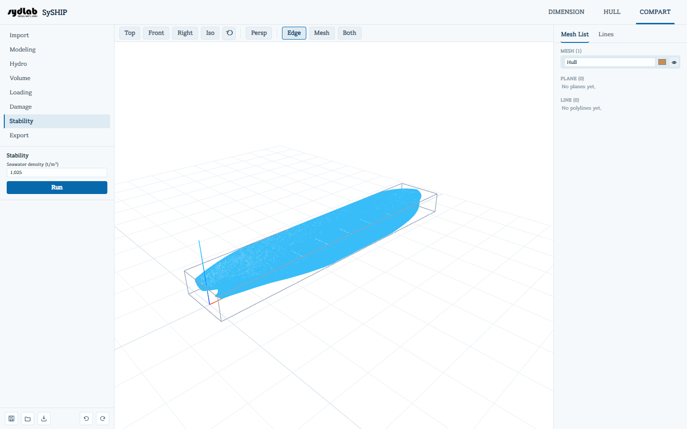

# Stability

**사용자가 직접 설정하는 범위**의 각 heel 각도에서 자유트림(free-trim) 평형을 계산하여 선박의 복원정(**GZ**) 곡선을 산출한 뒤, 이 곡선을 IMO/MARPOL/ICLL 복원성 기준과 비교 평가합니다. [Damage](damage.md)에서 아무것도 체크하지 않았다면 이는 일반적인 **intact(비손상) 복원성** 케이스이고, 하나 이상 침수 처리했다면 **손상 복원성** 케이스가 됩니다 — GZ 계산 자체는 동일하고, 비교하는 기준만 다릅니다.

Stability는 [Loading](loading.md) 탭에서 계산된 현재 총중량과 결합 무게중심을 선박의 무게로 그대로 사용합니다 — 해수 밀도 외에 별도의 무게 입력란은 없습니다. 또한 (임포트 시점에 저장된) 선체의 AP/FP를 이용해 계산된 트림 각도를 선형 트림 거리로 환산합니다.

1. **Seawater density (t/m³)**를 설정합니다(기본값 1.025).
2. **Heel** 범위를 설정합니다 — Start / Step / End(deg). 고정된 스윕이 아니라 해상도와 범위를 직접 정할 수 있습니다. Start가 0보다 크더라도 0°는 항상 포함되며, 스윕은 최대 181개 지점으로 제한됩니다.
3. 필요하면 **Openings**를 추가합니다(아래 참고).
4. **Run**을 클릭합니다.

## Openings

**Openings**는 down-flooding point — 즉 침수 개시 지점이 되는 선체 개구부(문, 통풍구, 해치)를 나열합니다. 이 개구부들이 물에 잠기는 시점이 intact 복원성의 면적 기준과 손상 복원성의 범위/최종 흘수선 기준에서 사용하는 **침수각** \(\phi_f\)을 결정합니다. 각 개구부는 **Name**과 **x / y / z (m)** 위치를 가지며, **+ Opening**으로 추가하고 × 버튼으로 제거합니다. 개구부를 하나도 정의하지 않으면 \(\phi_f\)는 복원정 소멸각(GZ 곡선이 마지막으로 0을 지나는 각도)으로 대체되며, 결과 화면에 이 대체 사실이 안내됩니다.

## 결과

- **GZ curve chart** — 실행이 끝나면 스윕한 각 heel 각도(deg)에서의 GZ(m)를 점으로 인라인 표시합니다.
- **View Details**를 클릭하면 전체 세부 내역을 담은 별도 창이 열립니다:
    - GZ 곡선을 큰 크기로 다시 보여주고, 스윕한 모든 지점(Heel, Draft, Trim, LCB, TCB, VCB, GZ, 수렴 여부)을 담은 **Download CSV**를 제공하며, 어떤 heel 지점이 완전히 수렴하지 못했다면 안내 문구가 함께 표시됩니다.
    - **Equilibrium** — Draft(m), Trim(선체 LBP를 알고 있으면 m, 아니면 원시 트림 각도), 계산된 평형 **Heel**(직립 안정 상태라면 0°, 리스팅/비대칭 상태라면 0°보다 크며 port/starboard로 표시), LCB/TCB/VCB(m), 평형 상태에서의 **갑판단 건현(deck-edge freeboard)**, **침수각** \(\phi_f\), 그리고 Openings를 정의했다면 평형 상태에서 각 개구부의 건현(흘수선과 같거나 그 아래면 강조 표시).
    - 평가된 **ruleset**마다 하나씩 섹션이 나오며, 각각 **All satisfied** 또는 **Not satisfied**와 개별 체크 항목별 행(✓/✗ 표시, 실제 값, 요구 값)을 보여줍니다:
        - **침수된 구획이 없을 때** → **Intact — IMO Res.A.749(18)** 하나만 평가됩니다. Area A(0–30°) ≥ 0.055 m·rad, Area A+B(0°부터 min(40°, \(\phi_f\))까지) ≥ 0.09 m·rad, Area B(30°부터 같은 상한까지) ≥ 0.030 m·rad, 30°에서의 GZ ≥ 0.20 m, 최대 GZ 각도 ≥ 25°, 그리고 초기 \(GM_0\) ≥ 0.15 m(스윕한 가장 작은 0이 아닌 heel에서 GZ 곡선 자체의 기울기로 산출)를 확인합니다.
        - **하나 이상의 구획이 침수되었을 때** → 대신 **Damage — MARPOL Annex I Reg.28**과 **Damage — ICLL Reg.27 (Type A)**가 함께 평가됩니다(이 경우 intact ruleset은 평가되지 않습니다). 각각 평형 heel을 한계값(MARPOL은 25°/30°, ICLL은 15°/17° — 갑판단이 물에 잠기지 않았다면 완화된 값 적용)과 비교하고, 평형점 이후 GZ가 양(+)인 범위(≥ 20°), 그 범위 안에서의 최대 잔류 GZ(≥ 0.1 m), 그 범위 안 곡선 아래 면적(≥ 0.0175 m·rad)을 확인하며, Openings가 정의되어 있다면 최종 흘수선이 가장 낮은 개구부보다 아래에 있는지도 확인합니다.
    - 선체의 AP와 depth를 알고 있으면 (실제로 침수 처리했는지와 무관하게) **Damage extents (reference)** 표가 표시됩니다. 이 표는 선체 자체의 \(L_f\), FP′, 폭, 그리고 [Loading](loading.md) 탭의 재화중량으로 계산한 MARPOL/ICLL의 측면·저면·저면 raking, ICLL 측면 손상 범위 공식(종/횡/수직)을 나열합니다 — [Damage](damage.md)에서 실제로 모델링한 파손 위치와 비교해보기 위한 참고 자료이며, SySHIP이 손상 케이스를 자동으로 배치하거나 크기를 정해주지는 않습니다.

실행 후에는 3D View가 선체/구획을 평형 heel과 trim에 맞춰 기울이고, 평형 흘수 위치에 반투명한 바닷물 평면을 그립니다.

!!! warning "지나치게 가벼운 적하 상태는 결과를 검산하세요"
    선체의 정상적인 배수량 범위를 크게 벗어나는 적하 상태(예: 화물/밸러스트를 전혀 싣지 않은 경하중량만의 상태)는 평형 solver를 물리적으로 비현실적인 극단적 결과로 몰아가거나, 깔끔하게 수렴하지 못하게 만들 수 있습니다. 계산 결과 흘수가 비정상적으로 깊거나 3D 미리보기가 이상하게 기울어져 있다면, 결과를 신뢰하기 전에 [Loading](loading.md) 상태의 총중량이 해당 선체에 현실적인 값인지 먼저 확인하세요.