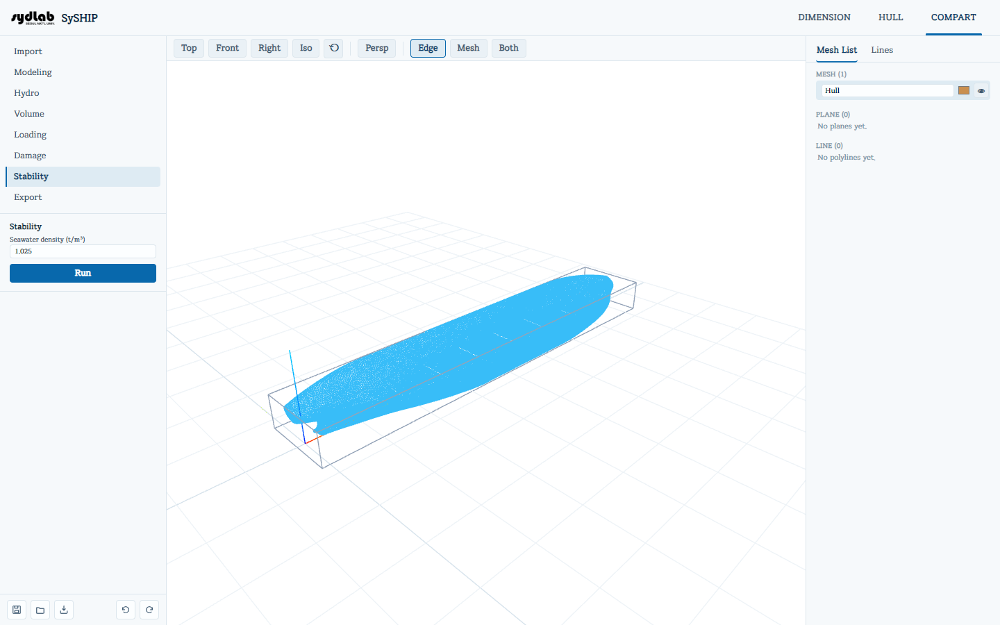

# Stability

Solves a free-trim equilibrium at each of a standard set of heel angles (0°, 2°, 5°, 10°,
15°, 20°, 30°, 40°, 50°, 60°) to build the ship's righting-arm (**GZ**) curve. With nothing
checked in [Damage](damage.md), this is the ordinary **intact stability** curve; with one
or more compartments flooded there, it's a **damage-stability** curve instead — the same
solve either way.

Stability uses the [Loading](loading.md) tab's current total weight and combined CG as the
ship's weight — there's no separate weight input here beyond seawater density. It also
uses the hull's AP/FP (captured at import) to convert the solved trim angle into a linear
trim distance.

1. Set **Seawater density (t/m³)** (default 1.025).
2. Click **Run**.

## Results

- **Equilibrium**: Draft (m), Trim (m if LBP is known, otherwise the raw angle), LCB/TCB/VCB
  (m), and the solved equilibrium **Heel** (0° for an upright-stable loading, greater than
  0° for a listing/asymmetric one). A warning appears if the bisection solver didn't
  converge at the equilibrium point.
- **GZ curve chart** — GZ (m) vs. heel angle (deg), one point per swept angle; a note flags
  it if any individual heel point failed to fully converge (treat those as approximate).
- **Download CSV** exports every swept point's Heel, Draft, Trim, LCB, TCB, VCB, GZ, and
  whether it converged.

Once run, the 3D View tilts the hull/compartments to the equilibrium heel and trim and
draws a translucent sea plane at the equilibrium draft.

!!! warning "Sanity-check very light loading conditions"
    A loading condition far outside the hull's normal displacement range (for example, a
    lightship weight with no cargo/ballast loaded at all) can push the equilibrium solver
    into an extreme, physically implausible result, or fail to converge cleanly. If a run
    produces a wildly deep draft or an oddly tilted 3D preview, check that your
    [Loading](loading.md) condition's total weight is realistic for the hull before trusting
    the result.
