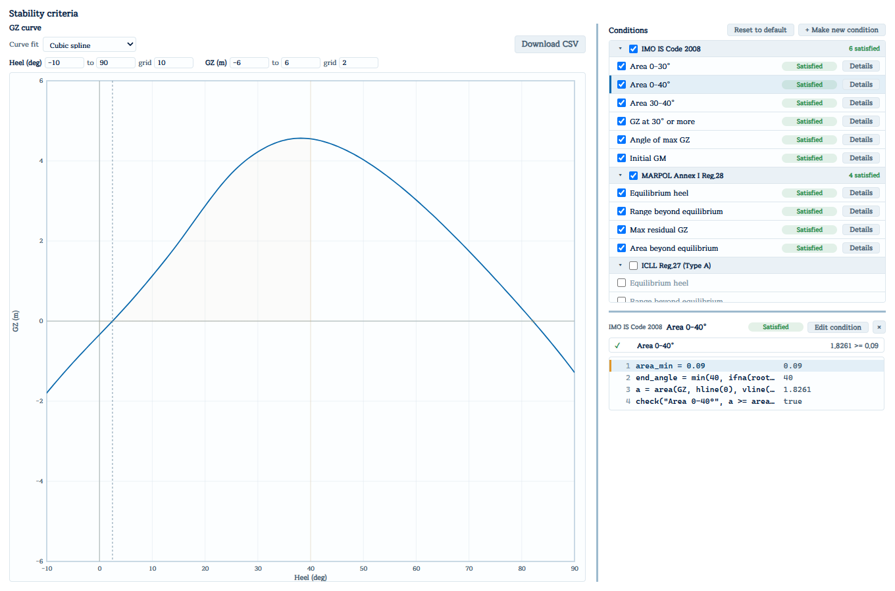

# Stability

Finds where the ship floats for the current loading condition and judges its righting-arm
(**GZ**) curve against stability criteria. With nothing flooded in [Damage](damage.md) this is
an **intact** case; with compartments flooded it is a **damage** case. The same physics runs
either way; only the default criteria differ.

Stability uses the [Loading](loading.md) tab's total weight and combined CG. Partly filled
liquid tanks are modeled with their real free surface: at every heel and trim the liquid is
re-leveled, so the free-surface effect is already in the GZ values.

Set **Seawater density (t/m³)** (default 1.025) at the top of the tab. It applies to both
sections below.

## 1. Equilibrium

Click **Find Equilibrium**. SySHIP solves heel, trim and draft together so that buoyancy
equals weight and the centre of buoyancy lines up with the centre of gravity.

The results show:

- **Heel** - size and side (port or starboard), or 0° (upright)
- **Trim** - angle, and the trim over the LBP when the hull's AP/FP are known
- **Waterline z** - the height of the water surface in the model's coordinates (not a draft
  measured from the keel)
- **Displacement**, **LCB**, **TCB**, **VCB**
- **Deck edge freeboard** - the smallest freeboard of the deck edge at equilibrium

**Show Result / Hide Result** switches the 3D View between the upright model and the
equilibrium attitude with an opaque sea surface at the equilibrium waterline.

## 2. GZ Curve

Set the **Heel step (deg)** (default 1°, from 0.25° to 90°) and click **Run GZ Curve**. The
heel is swept from -90° (port) to 90° (starboard) with free trim. A smaller step gives a
more accurate curve but takes longer.

Click **View Details** to open the **Stability criteria** window.

## Stability criteria window



### GZ curve (left)

- **Curve fit** - how the computed points are joined. The chosen fit is used for every
  value, intersection, peak and area in the criteria, not only for drawing.
    - **Cubic spline** (default) - smooth and accurate even with a coarse heel step; it can
      overshoot slightly where the curve bends sharply (for example at deck edge immersion).
    - **PCHIP** - smooth without overshoot, but a peak between two points is cut off.
    - **Linear** - straight lines between points.
- **Download CSV** - every computed point (heel, draft, trim, LCB, TCB, VCB, GZ, converged).
- **Heel / GZ** - start, end and grid spacing of each axis.

The curve is drawn toward the side the ship lists to as positive heel. The dashed line marks
the equilibrium heel.

### Conditions (right)

Each row is one condition. Tick its checkbox to include it; the result appears right away as
**Satisfied**, **Not satisfied**, **N/A** (a value it needs is not defined, for example no
vanishing angle within 90°) or **Error** (the script has a mistake). The checkbox in a group
header turns every condition in that group on or off.

Built-in conditions:

| Group | Conditions |
|---|---|
| IMO IS Code 2008 (MSC.267(85), same limits as A.749(18)) | Area 0-30° ≥ 0.055 m·rad, Area 0-40° ≥ 0.09 m·rad, Area 30-40° ≥ 0.03 m·rad, GZ at 30° or more ≥ 0.2 m, angle of max GZ ≥ 25°, initial GM ≥ 0.15 m |
| MARPOL Annex I Reg.28 | Equilibrium heel ≤ 25° (30° if the deck edge stays dry), range beyond equilibrium ≥ 20°, max residual GZ ≥ 0.1 m, area beyond equilibrium ≥ 0.0175 m·rad |
| ICLL Reg.27 (Type A) | Same as MARPOL with a heel limit of 15° (17°) |
| Constructions | GM by tangent at 0°, angle of vanishing stability (no pass/fail, for study) |

- An intact case starts with the IMO conditions on; a damage case starts with MARPOL and ICLL
  on. **Reset to default** goes back to that set.
- The 40° limits use 40° or the angle of vanishing stability, whichever is less. Openings
  (down-flooding points) are not modeled.
- **Initial GM** is the slope of GZ at upright, so it already includes free surface and any
  flooded compartments.

### Details

Click **Details** on a condition to open it below the list. It shows whether the condition is
satisfied, the value of each check against its limit, and the condition's script line by
line with the value each line produced. The GZ chart now draws that condition's construction
(lines, points and shaded areas). Click a script line to highlight the parts of the drawing it
depends on.

**Edit condition** turns the name and the script into editable fields in place. The drawing
and the result update as you type. **Save to conditions** stores the condition under **User**
so you can reuse it in other projects on this computer.

**+ Make new condition** starts an empty condition in edit mode.

### Writing a condition

Each condition is its own short script. For example:

```
area_min = 0.055
a = area(GZ, hline(0), vline(0), vline(30))
check("Area 0-30°", a >= area_min)
```

- `GZ` is the GZ curve (heel in degrees, GZ in metres) with the list side positive.
  `GZ_SIGNED` is the raw curve (+ heel = starboard down).
- Values from the run: `EQ_HEEL` (deg), `GM0` (m), `KG` (m), `DISP` (t), `DRAFT` (waterline
  z, m), `TRIM` (deg), `DECK_EDGE_IMMERSED`, `DECK_EDGE_ANGLE` (deg), `FLOODED`, `LIST_SIDE`.
  The edit view lists them with their current values.
- Drawing and measuring: `vline`, `hline`, `point`, `seg`, `line`, `tangent`, `at`, `slope`,
  `intersect` (needs exactly one crossing), `root` (first drop below zero), `peak`, `area`
  (m·rad), `x`, `y`.
- Helpers: `min`, `max`, `abs`, `deg2rad`, `rad2deg`, `ifna(value, fallback)`,
  `ifelse(condition, a, b)`, comparisons and `and` / `or` / `not`.
- `check("name", comparison)` records a pass/fail result with the actual and required values.
- Angles are in degrees. Areas come back in m·rad and slopes in m/rad.

The seawater density, heel step, conditions and curve fit are saved with the project. They can also be set from the [command line](../cli.md).

!!! warning "Sanity-check very light loading conditions"
    A loading condition far outside the hull's normal displacement range (for example, a
    lightship weight with no cargo or ballast) can push the solver into a physically
    implausible result or stop it from converging. If the draft looks far too deep or the 3D
    preview is oddly tilted, check that the [Loading](loading.md) total weight is realistic
    before trusting the result.
