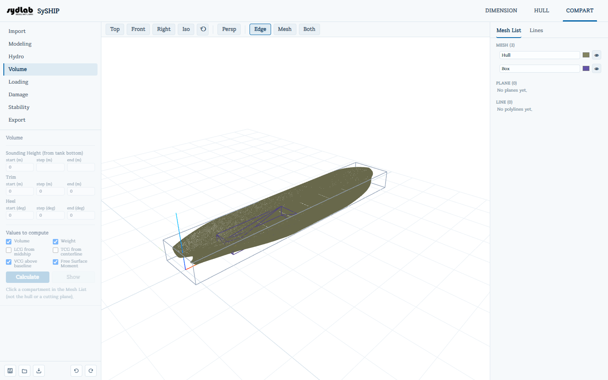
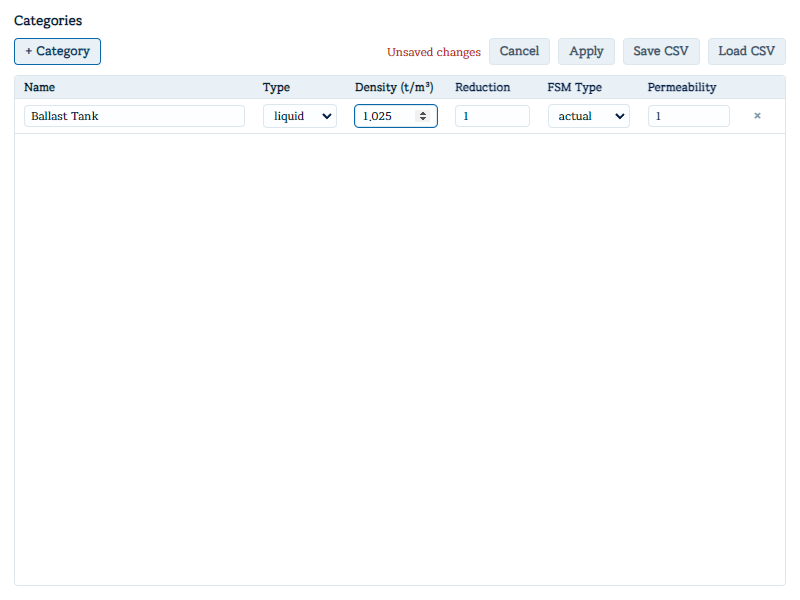

# Volume

한 번에 하나의 구획에 대해 화물/내용물 **카테고리**(liquid, solid, void — 밀도, 침투율, 자유표면 거동을 지정)를 부여하고, 채움 정도에 따른 용적/무게/무게중심을 나타내는 **sounding table**을 계산합니다.

먼저 **Mesh List**에서 구획을 클릭하세요 — Volume은 그곳에서 선택된 mesh에 대해서만 동작합니다(선체나 plane은 제외).

## 카테고리 지정

- 선택한 mesh 자체의 **Volume (m³)**과 **Centroid X/Y/Z (m)**이 상단에 읽기 전용으로 표시됩니다.
- **Category** 드롭다운에는 지금까지 정의된 모든 카테고리("Name (SG density)")와 "No category"가 나열됩니다. 하나를 선택하면 즉시 해당 mesh에 지정됩니다.
- **Open Category Editor**는 카테고리 관리자를 별도 창으로 엽니다:

  - **+ Category**로 행을 추가합니다(기본값: solid, density 1.0, reduction 1.0, FSM type "actual", permeability 1.0).
  - 카테고리별 필드: **Name**, **Type**(liquid/solid/void), **Density (t/m³)**, **Reduction**(0~1 — 구조재/보강재를 고려한 후 실제 적재 가능한 용적 비율), **FSM Type**(none/even/max/actual — 해당 탱크의 자유표면모멘트 계산 방식), **Permeability**(0~1 — [Damage](damage.md) 탭에서 해당 구획의 침수 계산에 그대로 사용되는 값).
  - **Apply**로 변경사항을 저장하고, **Cancel**로 되돌립니다. **Save CSV** / **Load CSV**로 전체 카테고리 목록을 스프레드시트 친화적인 파일로 주고받을 수 있습니다.

## Sounding table 계산

- **Sounding Height (from tank bottom)** — start/step/end(m). 선택한 mesh의 높이 범위로 자동 설정됩니다.
- **Trim** / **Heel** 범위(m / deg), 기본값 0/0/0.
- **Values to compute** — Volume (m³), Weight (ton), LCG/TCG/VCG (m), Free Surface Moment (ton·m). 기본적으로 Volume, Weight, VCG, FSM이 체크되어 있습니다.
- **Calculate**를 클릭한 뒤 **Show**로 결과 창을 엽니다([Hydro](hydro.md)의 결과 창과 동일한 Table/Curve/Export 구성입니다).

이 표가 특정 채움 비율에서 보고하는 무게/무게중심 값이 바로 [Loading](loading.md) 탭에서 그 구획을 채울 때 사용하는 값입니다.
