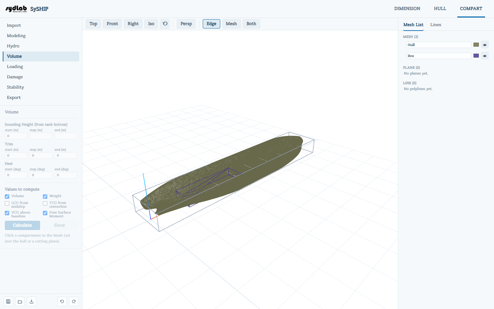
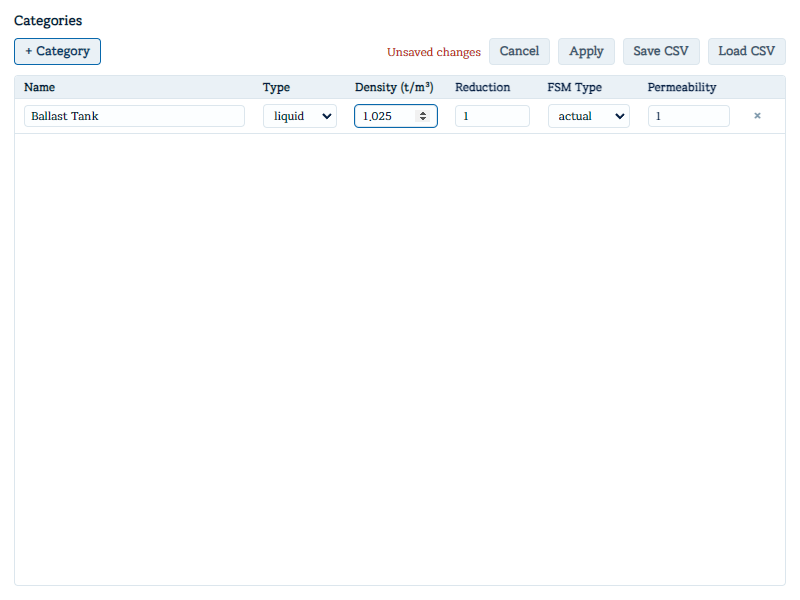

# Volume

한 번에 하나 이상의 구획에 대해 화물/내용물 **카테고리**(이름, 종류, 밀도, 색상)를 지정하고, 구획의 순수 기하학적 부피 중 실제로 화물/밸러스트 용량이나 침수 가능 공간으로 인정되는 비율을 정하는 세 가지 **loading factor**를 설정합니다.

먼저 **Mesh List**에서 하나 이상의 구획을 선택하세요 — Volume은 그곳에서 선택된 mesh(들)에 대해서만 동작합니다(선체나 plane에는 적용되지 않습니다).

## Category

- **Category** 드롭다운은 지금까지 정의한 모든 카테고리와 "No category"를 나열합니다(현재 선택된 구획들의 카테고리가 서로 다르면 "Mixed"로 표시됩니다). 하나를 고르면 즉시 선택된 모든 구획에 적용되며, 아래 안내에 종류와 밀도가 표시됩니다.
- **Open Category Editor**는 카테고리 관리자를 별도 창으로 엽니다:

  - **+ Category**는 행을 추가합니다(기본값: solid, 밀도 1.0, 임의의 색상).
  - 카테고리별 항목: **Name**, **Type**(liquid/solid), **Density (t/m³)**, 그리고 **Color** 스와치(Mesh List 행의 색조와 3D View 채움 색으로 사용됩니다). 카테고리는 더 이상 reduction/filling/permeability를 자체적으로 갖지 않습니다 — 이 값들은 아래처럼 각 구획별로 옮겨졌습니다.
  - **Apply**는 변경 사항을 저장하고, **Cancel**은 되돌리며, **Save CSV** / **Load CSV**는 카테고리 목록(Name/Type/Density/Color)을 스프레드시트 친화적인 파일로 주고받습니다. 구획에 아직 사용 중인 카테고리를 삭제하려 하면 확인을 요청합니다(적용하면 해당 구획들은 카테고리가 없는 상태가 됩니다).

## 구획별 loading factor

0~1 사이의 세 필드로, 구획 하나씩 또는 여러 구획을 선택해 한꺼번에 편집할 수 있습니다(선택한 구획들의 값이 다르면 "mixed"로 표시됩니다):

| 필드 | 의미 |
|---|---|
| **Reduction** | 구조물/보강재 공제 이후 실제로 실을 수 있는 공간의 비율입니다 — 예를 들어 기하학적 부피의 2%를 쓸 수 없다면 0.98. |
| **Filling** | 그 공간 중 실제로 채울 수 있는 질량의 비율입니다(열팽창/여유 공간 등을 고려한 값) — 예를 들어 열팽창 때문에 완전히 채울 수 없는 액체라면 0.98. |
| **Permeability** | [Damage](damage.md)에서 해당 구획이 침수되었을 때 바닷물이 채울 수 있는 비율입니다 — Reduction/Filling과는 별개이며, 일반적인 적재와는 관계없습니다. |

**Reduction**과 **Filling**을 곱한 값이 [Loading](loading.md)에서 해당 채움 비율의 부피 중 실제 화물/밸러스트 중량으로 인정되는 몫을 결정합니다: 특정 채움 비율에서, 실제로 채워진 부피에 `reduction × filling`을 곱한 뒤 카테고리 밀도를 곱해 무게를 구합니다. **Permeability**는 [Damage](damage.md)의 침수 공제에만 관여하며 일반적인 적재 계산에는 영향을 주지 않습니다.

Mesh List 패널 아래쪽의 **Inspector**는 선택 영역의 Category, Type, Density, Reduction, Filling, Permeability를 watertight 여부·부피·centroid와 함께 항상 읽기 전용으로 보여줍니다 — Volume 탭으로 전환하지 않고도 이 값들을 확인할 수 있어 편리합니다.