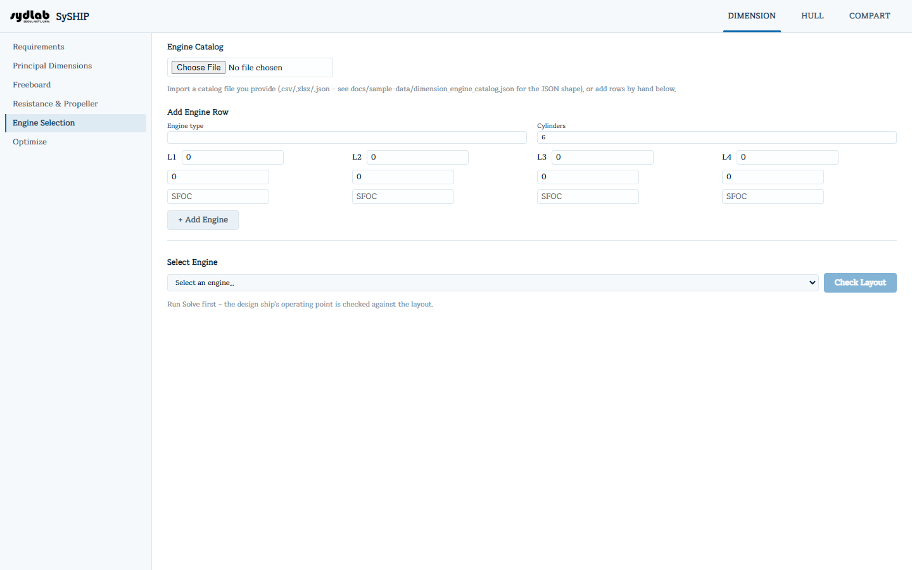

# Engine Selection

Build (or import) a catalog of candidate main engines — each defined by the 4-corner power/rpm
**layout diagram** printed in engine maker literature — then check whether the design's
required operating point falls inside a chosen engine's diagram, and read off the
interpolated fuel consumption.

## Engine Catalog

- Import a catalog file (`.csv`, `.xlsx`, `.xlsm`, or `.json`) via the file picker. There's
  no bundled default catalog — you provide your own.
- The catalog table lists every imported engine: Type, Cylinders, and its four corner
  points **L1–L4** (kW @ rpm). A small **×** button per row deletes that engine.
- Or add one by hand: **Engine type**, **Cylinders**, and each of **L1/L2/L3/L4** as
  kW / rpm / SFOC triples, then **+ Add Engine**.

## Select Engine

1. Pick an engine from the **Select an engine...** dropdown.
2. Click **Check Layout** (needs both an engine selected and a design ship from
   [Principal Dimensions](principal-dimensions.md)).

This takes the ship's operating point — preferably the MCR point from
[Resistance & Propeller](resistance-propeller.md)'s propeller design, or the parent ship's
frozen NCR as a fallback if you haven't run Design Propeller yet — and:

- Tests whether that point lies **inside** the engine's 4-corner layout polygon.
- Interpolates **SFOC** at that point from the 4 corners' values (inverse-distance
  weighting).

**Results:** the engine name, its operating point ("X kW @ Y rpm"), interpolated SFOC, and
a status badge — **Yes** (inside the layout) or **No — pick a different engine or cylinder
count**.

## Engine layout chart

Plots the engine's 4-corner layout polygon (power vs. rpm) as a closed quadrilateral, with
the operating chain (DHP → BHP → NCR → MCR) drawn on top as a labeled, hoverable line — the
classic "layout diagram" check used to confirm the operating line stays inside the engine's
permissible envelope.
