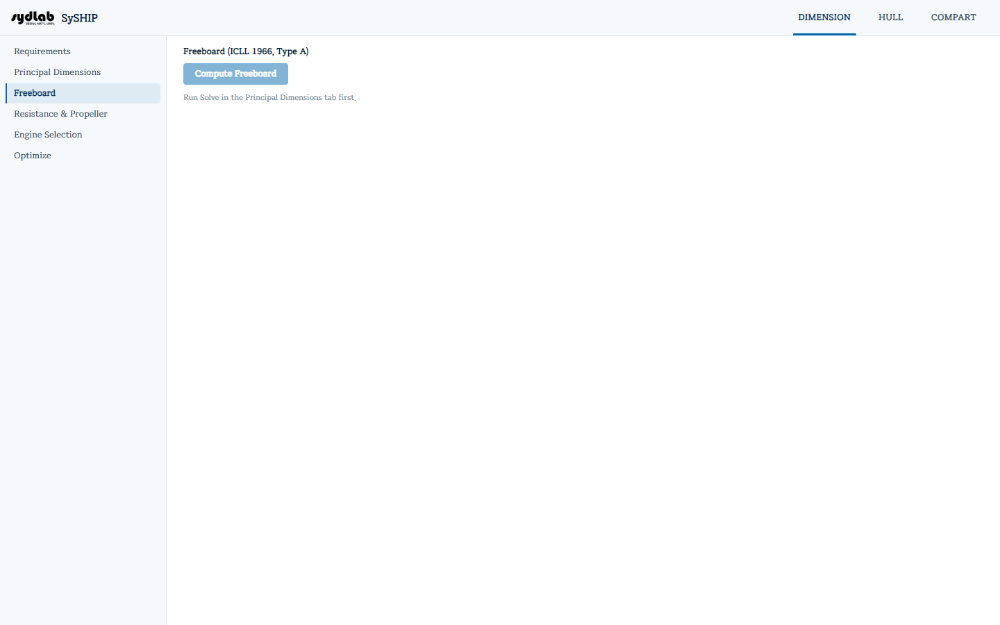

# Freeboard

**ICLL(International Convention on Load Lines) 1966, Type A** 규정에 따른 법정 최소 건현을 계산합니다. Type A는 구획성능이 우수하고 갑판 개구부가 작은 탱커 등 액체화물선에 적용되는 규정입니다. 이와 함께 요구되는 summer draft가 이 건현 안에서 실제로 확보 가능한지를 검토합니다.

**Compute Freeboard**를 클릭합니다 ([Principal Dimensions](principal-dimensions.md)에서 design ship이 산출되기 전까지는 비활성화되며 안내 문구가 표시됩니다).

## 결과 표

각 행은 필요한 경우 (▸/▾)로 펼쳐서 세부 내역을 볼 수 있습니다:

| 항목 | 비고 |
|---|---|
| Freeboard length (Lf) (m) | |
| Tabular freeboard (mm) | 공식 Reg. 28 Type-A 표에서 조회한 값입니다. |
| Correction for block coefficient (mm) | |
| Correction for depth (mm) | |
| Deduction for superstructure/trunks (mm) | 음수로 표시됩니다. Requirements의 Forecastle/Poop/Trunk 체크박스와 상부구조물 치수에 따라 결정됩니다. |
| Correction for sheer (mm) | AP/FP sheer 값과 표준 sheer curve를 Simpson 적분법으로 비교하여 산출합니다. |
| Correction for minimum bow height (mm) | |
| **Calculated summer freeboard (mm)** | 위 항목들의 합입니다. |
| Depth for freeboard (m) | |
| Maximum permissible summer draft (m) | |
| Required summer draft (Ts) (m) | Requirements/Design Ship에서 가져온 값입니다. |
| Margin (mm) | 허용 최대치에서 요구 draft를 건현 환산값으로 뺀 값으로, 0 이상이어야 합니다. |

## 규정 만족 여부

Margin이 0 이상이면 **Satisfied**, 그렇지 않으면 **Not satisfied — increase D or adjust CB** 배지가 표시됩니다.

[Optimize](optimize.md)는 탐색 과정의 모든 시도점에서 이 계산 결과(Margin ≥ 0)를 하드 제약조건으로 사용합니다.
