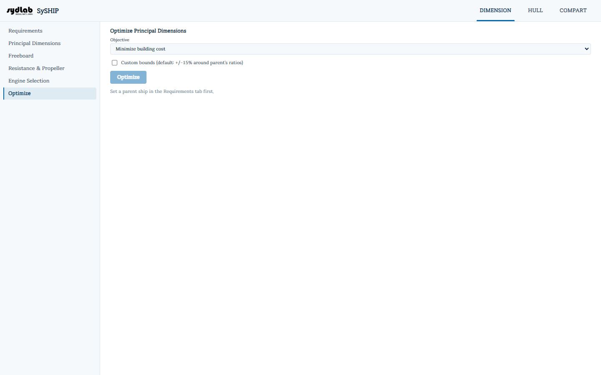

# Optimize

건현 규정과 합리적인 프루드수 범위를 만족시키면서, 선택한 목적함수를 가장 잘 만족하는 조합을 찾기 위해 두 개의 자유 제원비율 — L/B와, carrier type에 따라 CB(deadweight carrier) 또는 B/D(volume carrier) — 를 자동으로 탐색합니다.

## 설정

- **Objective**: Minimize building cost / Minimize effective power (EHP) at service speed / Weighted: cost + λ × EHP 중 선택합니다.
- **Lambda**(EHP 가중치) — Weighted objective를 선택했을 때만 표시됩니다.
- **Custom bounds** 체크박스 — 체크하지 않으면(기본값) parent ship 자체 비율의 ±15% 범위에서 탐색하고, 체크하면 **L/B min/max**와 **CB min/max**(또는 carrier type에 따라 **B/D min/max**) 필드를 직접 입력할 수 있습니다.

**Optimize**를 클릭합니다([Requirements](requirements.md)의 Parent Ship만 있으면 되고, 사전에 Solve를 실행할 필요는 없습니다).

## 탐색 방식

미분 없는(derivative-free) **COBYLA** 최적화 알고리즘을 사용합니다 — 목적함수 안에 이분법(bisection) solve가 포함되어 있어 그 낮은 수렴 정밀도가 SLSQP 같은 경사 기반 방법을 깨뜨리기 때문에 선택된 방식입니다. 매 시도마다 두 개의 부등식 제약조건이 적용됩니다: **건현 마진 ≥ 0**과 **프루드수 0.05~0.4 범위**.

## 결과

- **Converged**(Yes/No)와 **Evaluations** 횟수.
- **차트:** 시도별 목적함수 값(수렴 추이).
- **차트:** 시도별 건현 마진(항상 0 이상이어야 함).
- **차트:** 목적함수 값 vs. L/B, 그리고 vs. CB(또는 B/D) — 모든 시도점을 표시합니다.
- **Optimized Design**: LBP, B molded, D molded, CB, Building cost, 그리고 최종 목적함수 값.

탐색이 성공하면 이 결과가 활성 Design Ship을 **대체**합니다 — Principal Dimensions, Freeboard, Resistance & Propeller가 모두 최적화된 결과를 반영하게 되므로, 이들 및 Engine Selection을 다시 실행해 각자의 출력값을 갱신해야 합니다.
