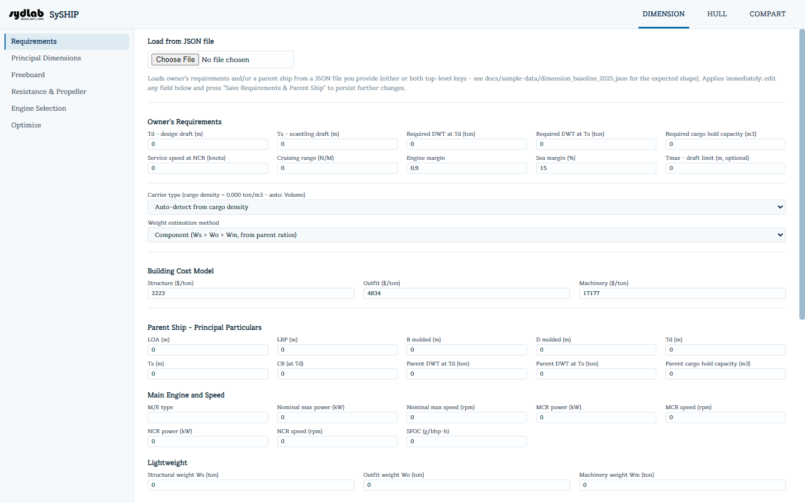

# Requirements

Requirements is where you enter the owner's stated requirements and the full particulars
of a **parent ship** — a similar, already-known reference vessel that SySHIP uses as the
empirical basis for scaling and coefficient estimation throughout DIMENSION. Nothing in the
rest of DIMENSION works until a parent ship is set here.

## Load from JSON file

You can load some or all of this page from a JSON file (containing `ownerRequirements`
and/or `parentShip` keys) instead of typing every field by hand. This applies immediately;
you can still edit any field afterward.

## Owner's Requirements

| Field | Unit | Meaning |
|---|---|---|
| Td – design draft | m | |
| Ts – scantling draft | m | |
| Required DWT at Td | ton | |
| Required DWT at Ts | ton | |
| Required cargo hold capacity | m³ | |
| Service speed at NCR | knots | |
| Cruising range | N/M | |
| Engine margin | ratio | NCR/MCR ratio, e.g. 0.9 = 10% margin between NCR and MCR. |
| Sea margin | % | |
| Tmax – draft limit | m | Optional; leave blank/0 for no limit. |

**Carrier type** — Auto-detect from cargo density, Deadweight Carrier, or Volume Carrier.
The label shows a live hint with the computed cargo density (DWT@Td ÷ cargo hold
capacity) and which type auto-detection would pick (the cutoff is 0.77 ton/m³: tankers and
bulkers are deadweight carriers above it, container/passenger ships are volume carriers
below it).

**Weight estimation method** — how lightweight (LWT) scales from the parent ship:
Component (Ws + Wo + Wm, from parent ratios),
DWT-proportional, or Volume-proportional (L×B×D).

**Building Cost Model** — $/ton rates for Structure, Outfit, and Machinery, used to compute
a building-cost estimate in Principal Dimensions and Optimize.

## Parent Ship – Principal Particulars

LOA, LBP, B molded, D molded, Td, Ts (all m), CB at
Td, and the parent's own DWT at Td/Ts and cargo hold
capacity.

## Main Engine and Speed

M/E type (text), Nominal max power (kW) / speed (rpm), MCR power/speed, NCR power/speed,
and SFOC (g/bhp-h).

## Lightweight

The parent ship's own known weight breakdown: Structural weight Ws, Outfit
weight Wo, Machinery weight Wm (all ton) — the basis for the
empirical weight-coefficient scaling used in Principal Dimensions.

## Resistance / Hull-form Detail

LWL, CM, CWP, CP, bulb area ABT (m²),
lcb (%LWL, + forward), rudder area (m²), bilge keel area (m²), bulb centroid
height hB (m), immersed transom area (m²), and a **Stern shape** dropdown
(Pram / V-shaped / Normal / U-shaped). These feed the Holtrop & Mennen resistance
prediction in [Resistance & Propeller](resistance-propeller.md).

## Propulsion Factors

Transmission efficiency, relative rotative efficiency (ηR), wake fraction (w),
thrust deduction (t) — the hull/propeller interaction coefficients used when designing the
propeller.

## Propeller

Diameter Dp (m), pitch ratio (P/Dp), number of blades, expanded area
ratio (AE/AO), and shaft center height (m).

## Freeboard

Deck type, length/height of superstructure, height of forecastle, sheer at AP/FP (mm),
freeboard deck thickness (m), waterplane area forward of Lf/2 (m²), and three
checkboxes — **Forecastle**, **Poop**, **Trunk** — that affect the statutory freeboard
deduction computed in [Freeboard](freeboard.md).

## Saving

Click **Save Requirements & Parent Ship** to persist everything on this page. There's no
per-field validation — a bad value only surfaces as an error message if a later Solve or
calculation fails because of it.
