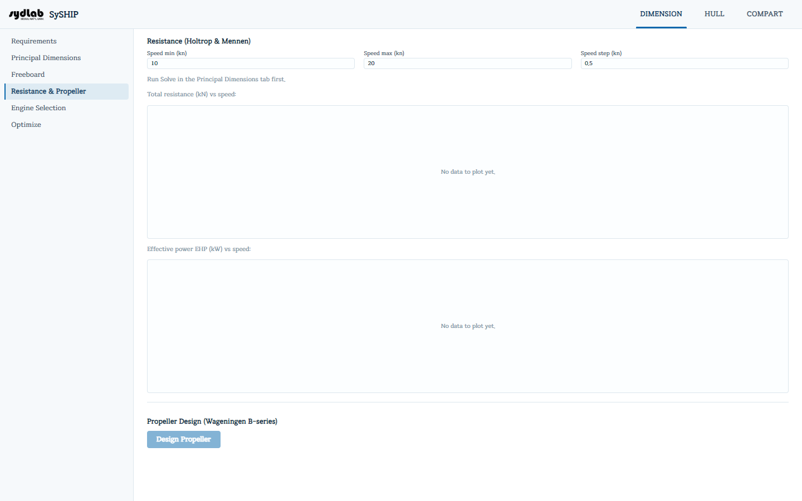

# Resistance & Propeller

Predicts calm-water resistance and effective power with the **Holtrop & Mennen (1984)**
method, then designs a matching propeller using **Wageningen B-series** open-water
KT/KQ regressions.

Both sections require a design ship from [Principal Dimensions](principal-dimensions.md)
(a hint appears otherwise).

## Resistance (Holtrop & Mennen)

Set **Speed min / max / step (kn)** (defaults 10 / 20 / 0.5) — the resistance curve
recomputes automatically about 300 ms after you stop typing, no separate "compute" button
needed.

- **Chart: Total resistance (kN) vs. speed**
- **Chart: Effective power EHP (kW) vs. speed** (EHP = resistance × speed)

## Propeller Design (Wageningen B-series)

Click **Design Propeller** to run a three-stage procedure:

1. **Stage 1** — propeller diameter Dp fixed at the Requirements value; sweeps
   pitch ratio, solves the advance coefficient J from the thrust identity, and picks the
   pitch that maximizes open-water efficiency η.
2. **Stage 2** — Dp made free too, solved via the torque identity against a
   target power/rpm (from a selected engine in [Engine Selection](engine-selection.md) if
   one exists yet, otherwise derived from Stage 1's own DHP→BHP→NCR chain with sea margin).
3. **Stage 3** — sweeps 10–20 kn at the final Dp/pitch to build the BHP/RPM
   operating curves.

**Results:** Stage 1 η and pitch ratio; Stage 2 (selected) Dp (m) and pitch (m,
= pitch ratio × Dp); Stage 2 η.

- **Chart: BHP (PS) vs. speed**
- **Chart: Engine RPM vs. speed**

The resulting operating-point chain (DHP → BHP → NCR → MCR) is what
[Engine Selection](engine-selection.md) checks against an engine's layout diagram.
