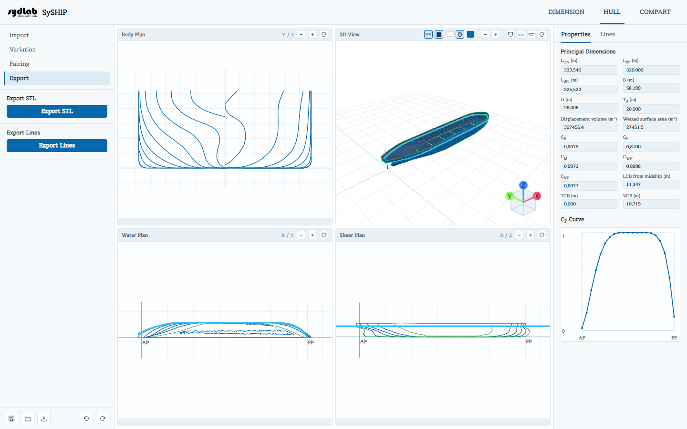

# Export

Export 서브탭에는 서로 독립된 두 가지 다운로드 기능이 있습니다:

## Export STL

지금까지 적용된 모든 Fairing/Variation 편집을 포함한 전체 삼각분할 선체 표면을 `hull_export.stl`로 다운로드합니다. station line이 존재하면 활성화됩니다.

## Export Lines

세 가지 라인 도면 뷰(Body / Water / Sheer Plan) 각각의 DXF 도면을 담은 `hull_lines.zip`을 다운로드합니다. 각 DXF는 자신의 2D 평면에 맞춰 평탄화되어 있어(어떤 DXF 뷰어에서 열어도 — 기본이 3D 탑뷰인 뷰어에서도 — 방향이 뒤집히지 않고 올바르게 표시됩니다), 오래된 CAD 도구와의 호환성을 위해 단순한 `POLYLINE`/`VERTEX` 엔티티를 사용합니다. 어떤 선이라도 존재하면 활성화됩니다(Import 마법사를 끝까지 완료할 필요 없이 station line만 있어도 됩니다).

!!! note "추후 지원 예정"
    다음 업데이트에서는 보조 도면 요소(좌표축, AP/FP, 흘수선, station 번호, 선 이름)를 별도의 DXF 레이어로 내보낼 수 있게 되고, 내보내기 전에 포함할 항목을 선택하는 옵션 대화상자도 추가될 예정입니다.
