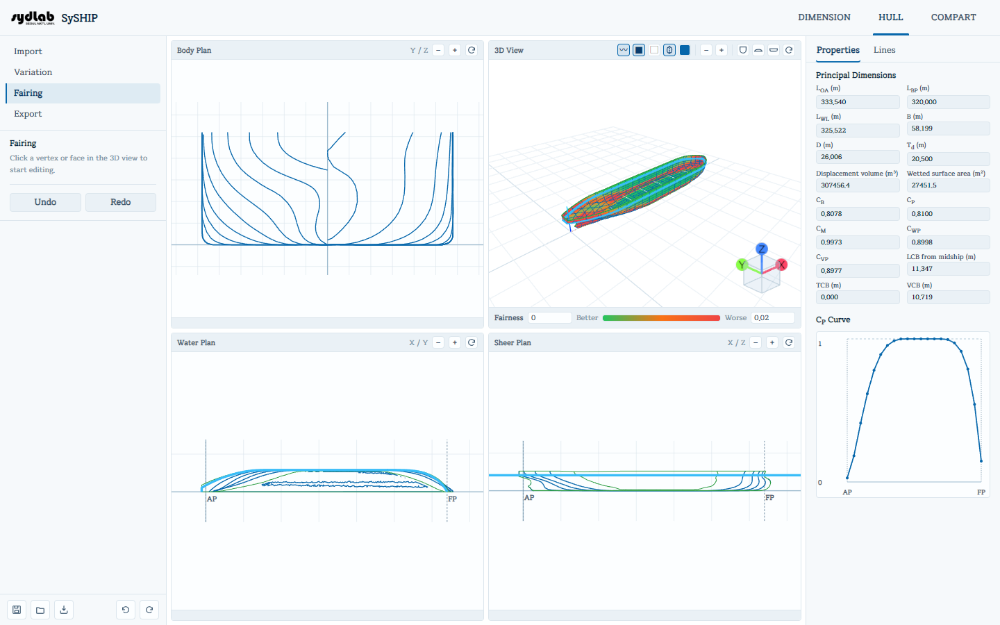

# Fairing

Fairing lets you make small, local corrections directly on the hull surface — nudging a
vertex, splitting a panel, or reshaping a region with a deformation lattice — and check the
result visually with a curvature (fairness) heatmap.

Opening the Fairing sub-tab automatically turns the **Surface** layer on (and the dense
**Mesh** wireframe off) in the 3D View, since fairing edits are made directly on the shaded
surface.

## Editing vertices and faces

Click a **vertex** or a **face** on the hull surface in the 3D View to select it.

- **Vertex selected**: the panel shows its current X/Y/Z position and three **dx/dy/dz (m)**
  fields. Enter an offset and click **Apply**, or click-and-drag the vertex directly in the
  3D View (a dashed guide line and a live dX/dY/dZ tooltip follow your cursor while dragging).
  A vertex that lies on the centerline (Y ≈ 0) has its **dy** locked to 0, so you can't
  accidentally break hull symmetry — a note explains this whenever it applies.
- **Face selected**: double-click inside the highlighted face to **split** it (adds a vertex
  at the click point and re-triangulates), giving you finer control over that area for a
  subsequent vertex edit.

Edits reshape the underlying surface mesh; the affected station/waterline/buttock lines,
hydrostatics, and \(C_P\) curve all recompute automatically.

## Fairness heatmap

The 3D View's **Surface** layer switches to a green→orange→red curvature heatmap whenever
you're on the Fairing sub-tab (and Surface is on). Green means low local curvature ("fair"),
red means high curvature (a likely kink or bump worth smoothing).

A legend appears under the 3D View:

| Element | Meaning |
|---|---|
| **Fairness** label | Identifies the legend as the curvature scale. |
| **Better** / **Worse** captions | Green (left) end = smoother/better; red (right) end = rougher/worse. |
| Two number fields | The min/max curvature values the color scale is stretched between — lower the max to make subtler curvature variation more visible, or raise it to tone down noise on a very rough mesh. |

The legend (and the heatmap itself) only appears while the **Surface** layer is switched on.

## Undo / Redo

The **Undo** and **Redo** buttons at the bottom of the panel step back and forward through
every hull edit — vertex moves, face splits, and Variation/FFD applications alike share the
same history.
