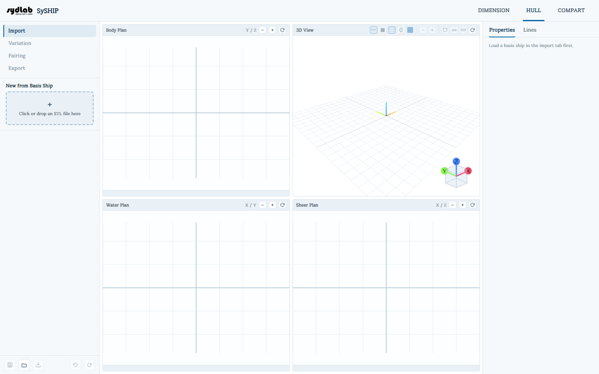
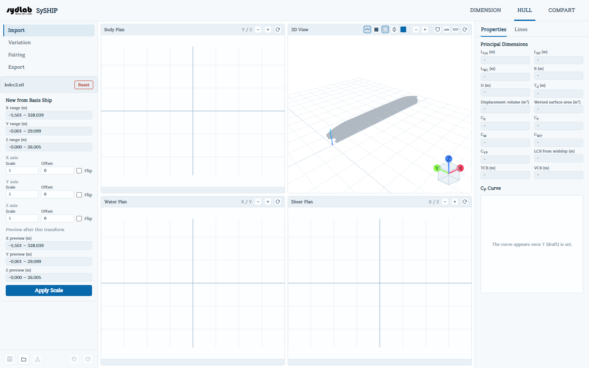
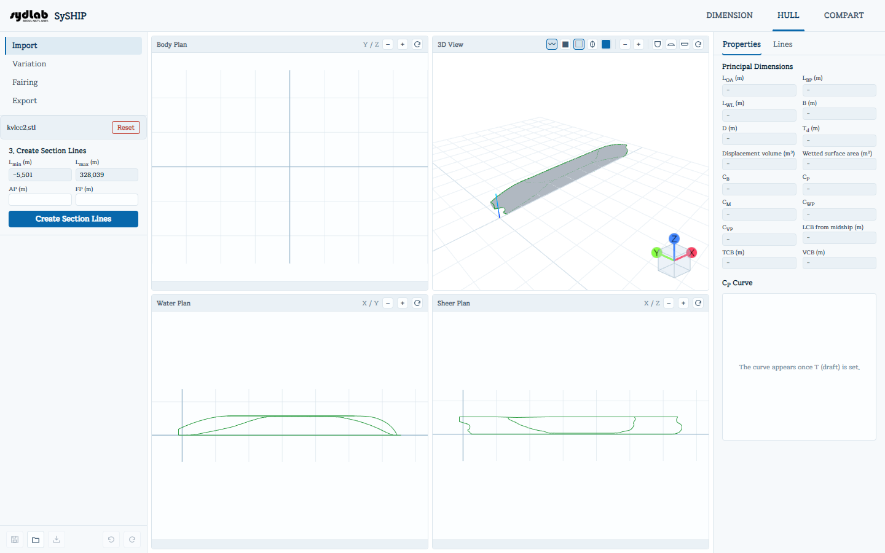
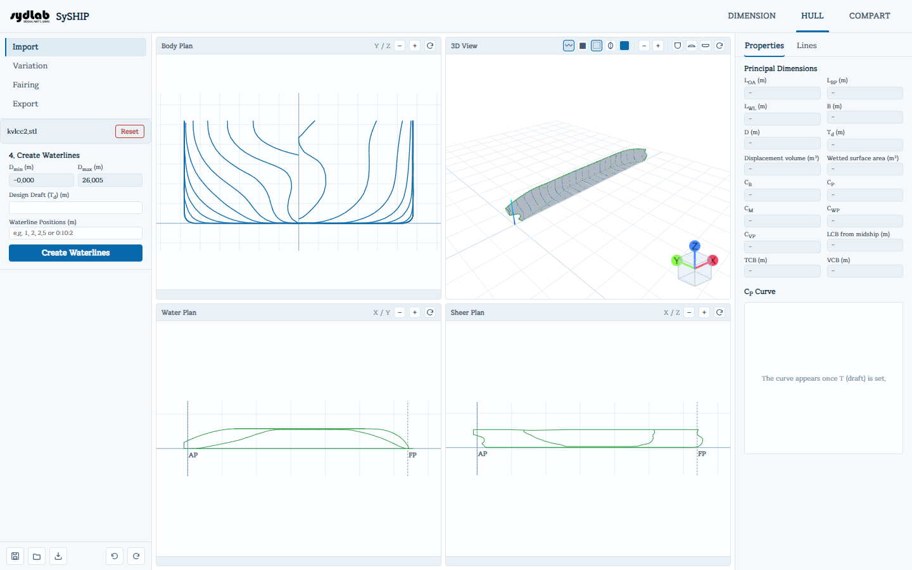
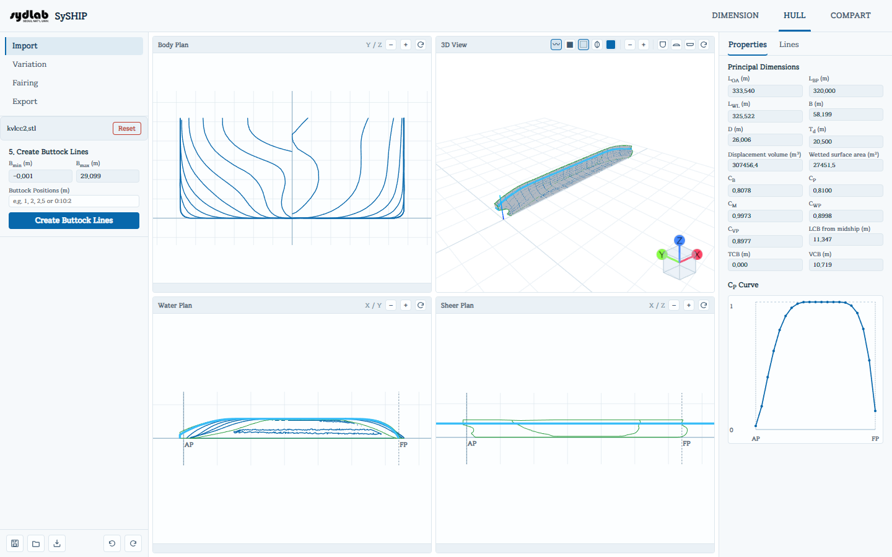
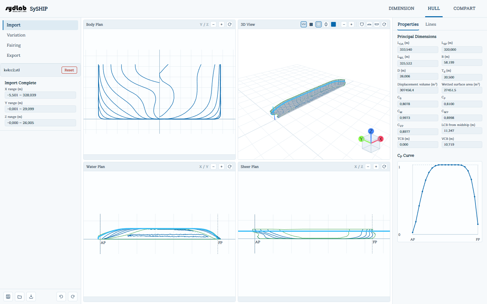
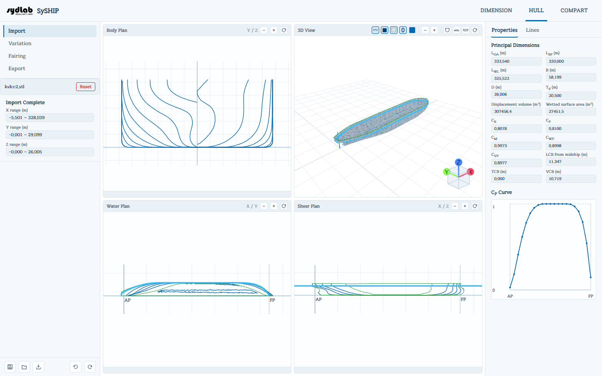
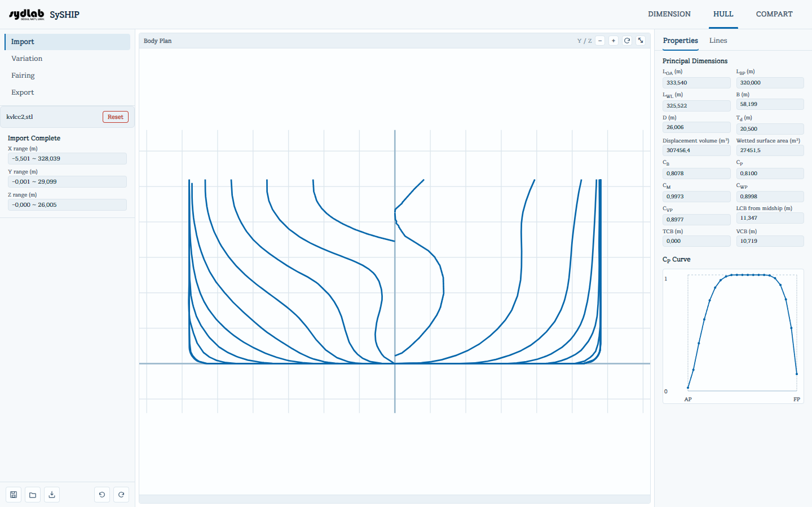
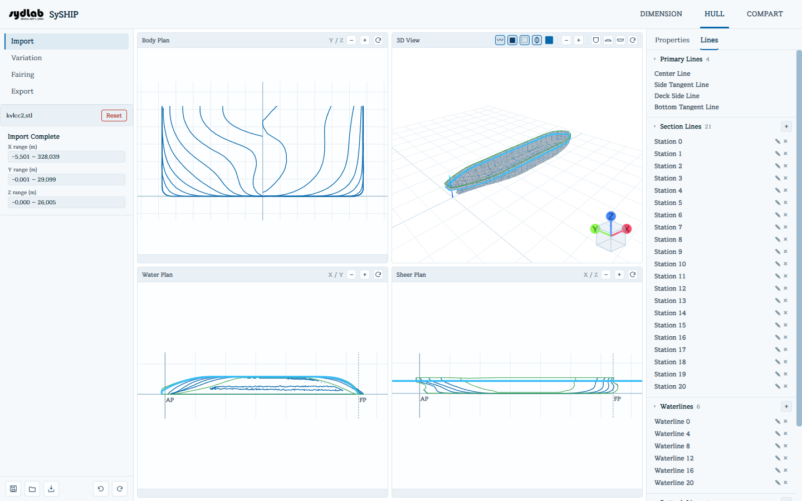

# 선체 임포트

Import 서브탭은 원본 STL 선체 표면을 실제로 작업 가능한 SySHIP 모델로 만들어줍니다: 스케일과 방향을 올바르게 맞추고, AP/FP를 설정하고, 이후의 모든 단계(Variation, Fairing, Export, COMPART)가 의존하는 station/waterline/buttock line을 생성합니다.

STL 파일은 **선체의 절반**(중심선 기준 좌현 또는 우현 한쪽)만 표현해야 합니다. SySHIP은 항상 Y = 0을 중심선으로 취급하며, "Full Ship"을 그리거나 내보낼 때 이 절반을 반대편으로 미러링합니다.

Import 패널은 순서대로 진행되는 5단계로 이루어져 있습니다. 단계를 건너뛸 수는 없지만("Create" 버튼을 눌러야 다음 단계로 넘어갑니다) 3D View와 Body/Water/Sheer Plan 패널은 각 단계마다 즉시 갱신되므로 매 단계의 결과를 바로 확인할 수 있습니다.

## 1. New from Basis Ship

드롭존을 클릭하거나 **STL 파일**을 드래그 앤 드롭합니다. 최초 실행 시 SySHIP은 몇 가지 샘플 선체(`kvlcc.stl`, `kvlcc2.stl`, `kcs.stl`)를 함께 제공하며, 파일 탐색기는 기본적으로 그 폴더를 가리키므로 직접 준비한 형상 없이도 바로 프로그램을 체험해볼 수 있습니다.

파일을 불러오면 패널에 메시의 원본 X/Y/Z 범위와, 축별 **Scale**, **Offset**, **Flip** 컨트롤이 표시됩니다:

| 컨트롤 | 효과 |
|---|---|
| **Scale** | 해당 축의 좌표를 배율만큼 곱합니다(모형 축척 STL을 실척으로 변환하거나, 단위가 잘못 들어온 축을 교정할 때 사용). |
| **Offset (m)** | 스케일 적용 후 해당 축을 이동시킵니다 — 보통 원점을 AP나 중심선으로 옮기는 데 사용합니다. |
| **Flip** | 해당 축을 미러링(부호 반전)합니다 — 임포트한 선체가 뒤집혀 있거나, 선수/선미가 바뀌었거나, 중심선 기준 반대쪽에 있을 때 사용합니다. |

**preview** 행에는 변환을 적용한 *후*의 X/Y/Z 범위가 표시되므로, 값을 확정하기 전에 미리 확인할 수 있습니다. **Apply Scale**을 클릭하면 변환이 확정되고 다음 단계로 넘어갑니다(불러온 파일명 옆의 **Reset** 버튼으로 언제든 처음부터 다시 시작할 수 있지만, 이 경우 Import/Variation 진행 상황이 모두 초기화됩니다).

## 2. Create Section Lines

선체의 종방향 축을 따라 미터 단위로 **AP**(선미수선)와 **FP**(선수수선) 위치를 입력합니다. 그러면 SySHIP이 자동으로 선체를 21개의 표준 **station line**(AP의 Station 0부터 FP의 Station 20까지 등간격)으로 절단합니다 — 이는 조선 라인 도면 전반에서 사용하는 0~20 station 번호 체계와 동일하며, Body Plan과 HULL 트리 뷰에서도 같은 번호 체계를 사용합니다.

## 3. Create Waterlines

- **Design Draft (Td)** — 설계 흘수를 미터 단위로 입력합니다. 프로젝트 전체에서 가장 중요한 값으로, 정수력학 계산(배수량, 침수표면적, \(C_B\)/\(C_P\)/\(C_M\)/\(C_{WP}\), \(LCB\)/\(TCB\)/\(VCB\), 그리고 Properties 패널의 \(C_P\) 곡선)을 좌우하며 이후 Variation과 COMPART에서도 사용됩니다.
- **Waterline Positions (m)** — 쉼표로 구분된 Z 위치 목록으로, 각 항목은 단일 값이거나 `start:end:step` 형태의 범위입니다. 예:
  - `2, 4.5, 8`은 정확히 그 높이에 세 개의 waterline을 만듭니다.
  - `0:20:4`는 0부터 20까지 4m 간격으로 waterline을 만듭니다(0, 4, 8, 12, 16, 20).
  - 두 형태를 한 항목에 섞어 쓸 수도 있습니다. 예: `0:20:4, 20.5`.
  - 범위의 시작이나 끝을 비워두면(예: `:20:4`) 선체 자체의 Z 범위 경계값이 사용됩니다.

## 4. Create Buttock Lines

waterline과 개념은 같지만, 이번에는 고정된 Y(폭) 위치에서의 수직 절단인 **buttock line**을 만들며, Sheer Plan에 사용됩니다. **Buttock Positions (m)** 필드는 waterline positions와 동일한 쉼표 목록 / `start:end:step` 문법을 사용합니다.

## 5. Import Complete

임포트하고 변환한 선체의 최종 X/Y/Z 범위를 읽기 전용으로 요약해서 보여줍니다. 이 시점부터 왼쪽 서브탭 목록에 **Variation**, **Fairing**, **Export**가 활성화되고, 아래에서 설명하는 전체 작업 화면이 채워집니다.

## 작업 화면

Section line이 생성되면, HULL의 어느 서브탭(Import/Variation/Fairing/Export)에 있든 항상 동일한 4분할 레이아웃이 메인 영역에 표시됩니다 — **Body Plan**(Y/Z), **3D View**, **Water Plan**(X/Y), **Sheer Plan**(X/Z):

### 2D 평면도 (Body / Water / Sheer)

각 2D 평면도는 확대/축소·이동이 가능한 인터랙티브 SVG 도면입니다:

- 드래그하면 이동, 스크롤하면 확대/축소되며, 헤더의 **−** / **+** 버튼으로도 조절할 수 있습니다.
- **Fit View**(원형 화살표 아이콘)는 보이는 모든 선이 화면에 들어오도록 팬/줌을 초기화합니다.
- 패널 제목 표시줄을 더블클릭하면 해당 패널이 작업 영역 전체를 채우도록 **최대화**되며, 다시 더블클릭(또는 ⤡ 버튼)하면 4분할 그리드로 돌아갑니다.
- 선 위에 마우스를 올리면 이름이 툴팁으로 표시되고, 클릭하면 해당 선이 선택되어(3D View를 포함한 모든 뷰에서 강조 표시) 패널 하단 상태 표시줄에 현재 커서 위치(해당 평면도의 두 축 기준)가 표시됩니다.
- **Water Plan**과 **Sheer Plan**에는 점선으로 표시되는 **AP**/**FP** 기준선이 있습니다. **Sheer Plan**에는 추가로 설계 흘수(정수력학 계산에 사용되는 waterline) 위치에 실선이 표시됩니다.
- **Body Plan**은 각 station line을 중심선 기준으로 자동으로 미러링하여 (임포트한 절반만이 아니라) 항상 전체 단면을 보여줍니다.

### 3D View

3D 뷰포트 위 툴바를 왼쪽부터 순서대로 설명하면:

| 아이콘/컨트롤 | 이름 | 효과 |
|---|---|---|
| 〰 | **Wireframe** | 표면 메시 위에 단순 와이어프레임 오버레이를 켜고 끕니다. |
| ■ | **Surface** | 음영 표면을 켜고 끕니다. 바깥쪽을 향한 면은 선택한 색으로, (개구부를 통해 보이거나 "Full Ship"이 켜졌을 때 보이는) 안쪽 면은 더 어둡고 채도가 낮게 그려져 어느 쪽을 보고 있는지 항상 구분할 수 있습니다. |
| ▢ | **Mesh** | 삼각분할된 표면 메시 위에 촘촘한 와이어프레임을 직접 그려서 켜고 끕니다(위의 Wireframe 레이어는 station/water/buttock line만 성기게 보여주는 것과 다릅니다). |
| <svg width="14" height="14" viewBox="0 0 16 16" fill="none" stroke="currentColor" stroke-width="1.3" stroke-linecap="round" stroke-linejoin="round"><path d="M8 1.5v13" stroke-dasharray="1.6 1.6"/><path d="M8 3c2.5 0 4 1.5 4 5s-1.5 5-4 5"/><path d="M8 3c-2.5 0-4 1.5-4 5s1.5 5 4 5"/></svg> | **Full Ship** | 현재 그려진 모든 요소(표면, 라인)를 중심선 기준으로 미러링하여, 모델링한 절반이 아닌 전체 선박을 보여줍니다. |
| (색상 스와치) | **Surface Color** | 선체 음영 표면의 색상을 선택합니다. |
| − / + | **Zoom Out / Zoom In** | 카메라를 현재 오빗 타깃 쪽으로/에서 멀어지는 방향으로 이동시킵니다. |
| <svg width="14" height="14" viewBox="0 0 16 16" fill="none" stroke="currentColor" stroke-width="1.3" stroke-linecap="round" stroke-linejoin="round"><path d="M3 3h10"/><path d="M3 3v5a5 5 0 0 0 10 0V3"/></svg> | **Section View** | 선박의 종축(\(X\))을 따라 정면으로 바라보는 시점(Body Plan 뷰)으로 전환합니다. |
| <svg width="14" height="14" viewBox="0 0 16 16" fill="none" stroke="currentColor" stroke-width="1.3" stroke-linecap="round" stroke-linejoin="round"><path d="M2 10h12"/><path d="M2 10c1-4 11-4 12 0"/></svg> | **Elevation View** | 선박의 폭 방향 축(\(Y\))을 따라 정면으로 바라보는 시점(Profile/Sheer 뷰)으로 전환합니다. |
| <svg width="14" height="14" viewBox="0 0 16 16" fill="none" stroke="currentColor" stroke-width="1.3" stroke-linecap="round" stroke-linejoin="round"><path d="M2 6h12"/><path d="M2 6v2a2 2 0 0 0 2 2h8a2 2 0 0 0 2-2V6"/></svg> | **Plan View** | 위에서 아래로 내려다보는 시점(\(Z\), Waterplane 뷰)으로 전환합니다. |
| <svg width="14" height="14" viewBox="0 0 16 16" fill="none" stroke="currentColor" stroke-width="1.3" stroke-linecap="round" stroke-linejoin="round"><path d="M13 8a5 5 0 1 0-1.5 3.6"/><path d="M13 4.5V8H9.5"/></svg> | **Fit View** | 보이는 모든 형상이 화면에 들어오도록 카메라를 재조정합니다. |

카메라 조작: 좌클릭 드래그로 회전, 스크롤로 확대/축소, 우클릭 드래그(또는 두 손가락 드래그)로 이동합니다. 우측 하단의 작은 **좌표계 아이콘**(색상이 입혀진 큐브)은 선박의 X/Y/Z 축을 기준으로 현재 보고 있는 방향을 항상 보여줍니다 — 이 큐브의 면, 모서리, 꼭짓점을 클릭하면 카메라가 정확히 그 시점으로 전환됩니다.

Fairing 서브탭의 곡률 히트맵이 활성화되어 있으면 3D View 아래에 **Fairness** 범례가 표시됩니다 (자세한 내용은 [Fairing](fairing.md) 참고).

### Lines 트리 (오른쪽 패널)

오른쪽 패널의 **Lines** 탭(**Properties** 옆)에는 모델에 존재하는 모든 선이 유형별로 그룹지어 표시됩니다:

- **Primary Lines** — Center Line, Side Tangent Line, Deck Side Line, Bottom Tangent Line으로, 선체가 스케일링된 이후 자동으로 계산됩니다.
- **Section Lines** — station line(0~20번)입니다. 추가 입력란에 새 station 번호를 입력해 즉시 생성할 수 있고, 기존 선 옆의 연필/× 아이콘으로 이름 변경(재배치)이나 삭제를 할 수 있습니다.
- **Waterlines** / **Buttock Lines** — station 번호 대신 미터 단위 Z 또는 Y 위치를 사용한다는 점만 다르고 추가/변경/삭제 방법은 동일합니다.

행을 클릭하면 해당 선이 그려진 모든 뷰(2D 평면도와 3D View)에서 함께 선택됩니다.

## 프로젝트 액션 (하단 고정 바)

HULL 도구 패널 하단의 바는 모든 HULL 서브탭에서 항상 사용할 수 있습니다:

| 아이콘 | 동작 |
|---|---|
| <svg width="14" height="14" viewBox="0 0 16 16" fill="none" stroke="currentColor" stroke-width="1.3" stroke-linejoin="round"><rect x="2" y="2" width="12" height="12" rx="1"/><path d="M4.5 2v3.5h5.5V2"/><rect x="5" y="9" width="6" height="4"/></svg> | **Save** — 마지막으로 사용한 파일에 프로젝트를 저장합니다(아직 없다면 Save As처럼 동작). |
| <svg width="14" height="14" viewBox="0 0 16 16" fill="none" stroke="currentColor" stroke-width="1.3" stroke-linejoin="round"><path d="M2 4.5h4l1.2 1.5H14v7a1 1 0 0 1-1 1H3a1 1 0 0 1-1-1v-8.5z"/></svg> | **Load** — 저장된 `.zip` 프로젝트 파일을 엽니다. |
| <svg width="14" height="14" viewBox="0 0 16 16" fill="none" stroke="currentColor" stroke-width="1.3" stroke-linecap="round" stroke-linejoin="round"><path d="M8 1.5v7M5.5 6.5 8 9l2.5-2.5"/><path d="M2.5 10v3a1 1 0 0 0 1 1h9a1 1 0 0 0 1-1v-3"/></svg> | **Save As** — 저장 위치를 지정하며, 프로젝트가 `.zip`으로 저장됩니다. |
| <svg width="14" height="14" viewBox="0 0 16 16" fill="none" stroke="currentColor" stroke-width="1.3" stroke-linecap="round" stroke-linejoin="round"><path d="M3 8a5 5 0 1 1 1.5 3.6"/><path d="M3 4.5V8h3.5"/></svg> / <svg width="14" height="14" viewBox="0 0 16 16" fill="none" stroke="currentColor" stroke-width="1.3" stroke-linecap="round" stroke-linejoin="round"><path d="M13 8a5 5 0 1 0-1.5 3.6"/><path d="M13 4.5V8H9.5"/></svg> | **Undo / Redo** — 선체 모델의 편집 이력을 앞뒤로 이동합니다(Fairing과 Variation 편집도 함께 포함됩니다). |
