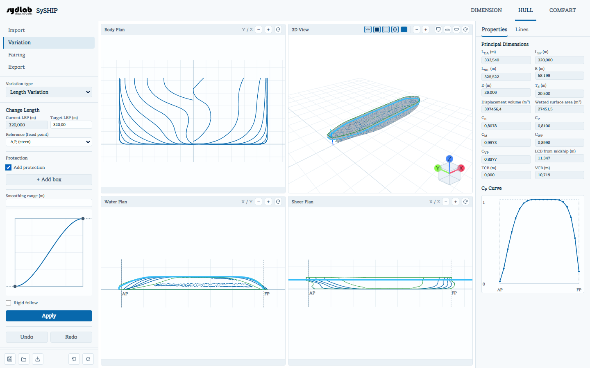
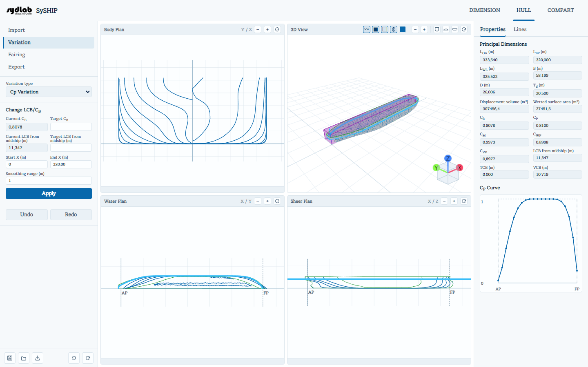
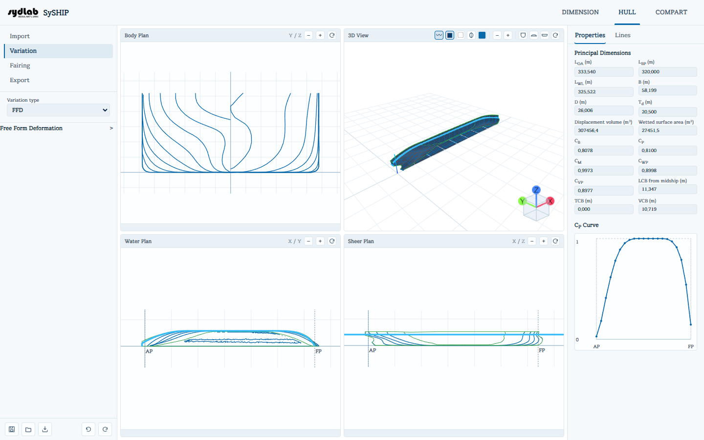

# Variation

Variation reshapes the *whole* hull (as opposed to Fairing's local vertex/face edits) toward
a new target dimension or coefficient, while keeping the hull's overall character. Pick a
**Variation type** from the dropdown; the panel below it switches to match.

Every Variation panel that changes a global dimension shows its **current** value read from
the hull alongside a **target** value you type in, and a bold **Change &lt;X&gt;** title.
Where a DIMENSION tab design ship exists, a **"Reset to DIMENSION recommendation"** button
appears so you can adopt that value with one click.

## Change Length

- **Current LBP** (read-only) vs. **Target LBP (m)**.
- **Reference (fixed point)** — which point stays put while the rest of the hull stretches
  or shrinks to hit the target length: **A.P. (stern)**, **F.P. (bow)**, **Midship**, or a
  **Custom position (m)**.

## Change Breadth

- **Current B** (read-only, taken from the hull's Y extent, mirrored) vs. **Target B (m)**.

## Change Depth

- **Current D** (read-only, from the hull's Z extent) vs. **Target D (m)**.

## Change Draft

- **Current Td** vs. **Target Td (m)**. Applying this simply
  recomputes hydrostatics at the new draft — it does not reshape the hull.

## Change LCB/CB

Uses a Lackenby-style transformation to shift the prismatic curve so the hull reaches a
target block coefficient and/or longitudinal center of buoyancy:

- **Current CB** vs. **Target CB** (a **Reset to DIMENSION
  recommendation** button appears if available).
- **Current LCB from midship (m)** vs. **Target LCB from midship (m)**.
- **Start X (m)** / **End X (m)** — the *active zone*: the X range (measured from AP) over
  which the transformation is allowed to reshape the hull. Outside this zone the hull is
  left unchanged.
- **Smoothing range (m)** — blends the transformation smoothly into the untouched region
  at the edges of the active zone, instead of a hard cutoff.

## Protection (Length / Breadth / Depth Variation)

Any of the Length, Breadth, or Depth panels can define **protection boxes** — regions of
the hull that should stay rigid while the rest deforms:

- **Add protection** checkbox reveals the box list.
- **+ Add box** adds a box defined by **Min/Max X/Y/Z (m)**; each box has its own enable
  checkbox and a **Remove** button.
- **Smoothing range (m)** — how far outside a protection box the deformation is blended
  back in, instead of stopping abruptly at the box wall.
- The **falloff curve** editor below it shapes exactly how that blend tapers, over the
  normalized distance from the box edge (X axis) to full deformation (Y axis):
  - Drag a point or its tangent handles to reshape the curve.
  - Double-click empty space on the curve to add a new point; double-click an existing
    (non-endpoint) point to remove it.
- **Rigid follow** — when checked, geometry inside the protection boxes translates/rotates
  rigidly along with the surrounding deformation instead of staying fixed in place.

## FFD (Free Form Deformation)

FFD gives you full manual control over a local deformation, using a deformation lattice —
a bounding box with 8 corner handles you can pull in 3D:

1. **Bounding box (m)** — set **Min X/Y/Z** and **Max X/Y/Z** directly, or click **Fit to
   hull bounds** to snap the box to the current hull's extents. **Reset bounding box**
   clears it.
2. Once a box is set, its 8 corner handles appear as colored points in the 3D View. Click
   one (it's labeled by which octant it's in, e.g. "X+ Y- Z+") to select it, then either:
   - Drag it directly in the 3D View (a live dX/dY/dZ tooltip follows the cursor), or
   - Type its **Displacement (dx/dy/dz, m)** or its absolute **Target position (x/y/z, m)**
     directly in the panel.
   - **Reset corner displacement** clears just that corner back to zero.
3. **Smoothing range (m)** and the same falloff-curve editor as Protection control how the
   deformation fades outward from the lattice box.
4. Click **Apply** to bake the deformation into the hull surface. A live wireframe preview
   of the predicted shape is drawn in the 3D View while you're dragging a corner, before
   you apply.

The panel header's **&gt;** chevron collapses/expands the whole FFD section.

## Undo / Redo and Protection

Every Variation "Apply" is a step in the same shared undo/redo history as Fairing edits —
use the **Undo/Redo** buttons at the bottom of the panel (or the sticky footer's icons) to
step back through a chain of variations.
